:orphan:

.. Notes on how comments are going to be made and managed on the documentation pages, using PageProofer.

Commenting
==========

If you have been included in the list of stakeholders who can comment on this documentation, you will have the ability to make comments and track the comments made by others and the Vivacity response to them.

PageProofer
-----------

Setting up
```````````

We are using PageProofer (www.pageproofer.com) to manage the comments.  You may have received an email inviting you to join PageProofer. Once you join up and log in, you will see a screen similar to this:

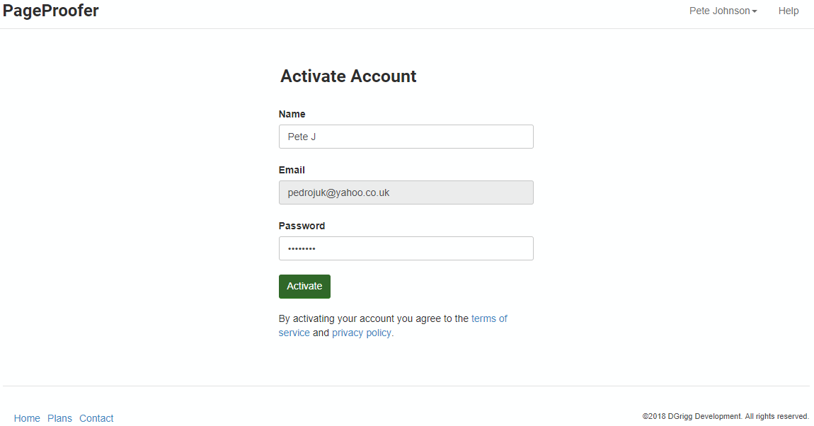


Enter a password and click ``Activate`` to activate your account.

Once you've activated your account, you'll see a page like this:

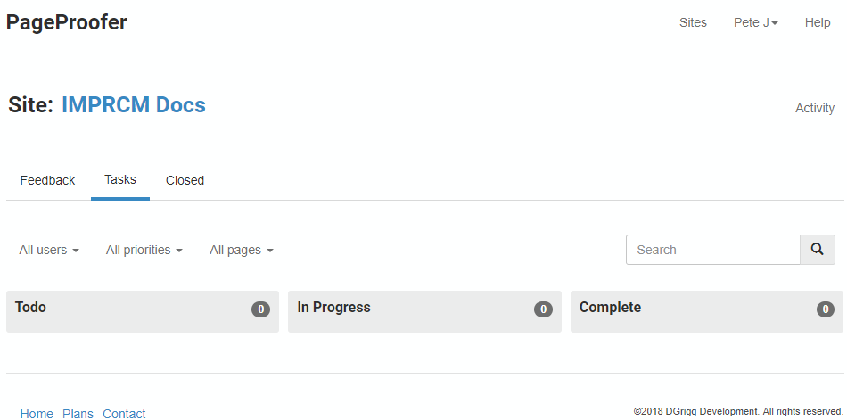


This is the PageProofer dashboard. It shows the status of comments on the IMPRCM documentation site. If you click the title, you'll be taken to the site.

.. tip:: It may be worth bookmarking this dashboard page as it will give you a good place to start with commenting the documentation.  The link to the documentation site here will always work even if VRC have to move the site around during development.
		 
The commenting pen
````````````````````

Once you are logged in to PageProofer and you navigate to the IMPRCM documentation site, you will see something like this:

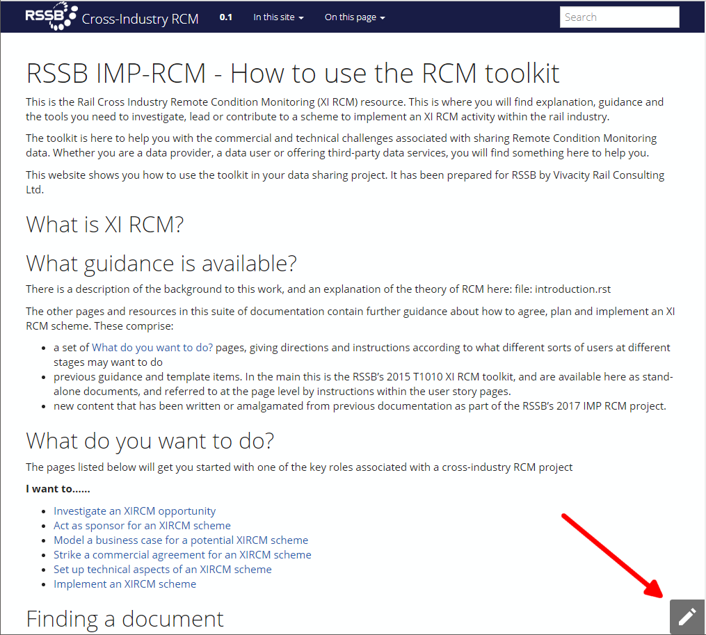

The pen icon in the bottom right of the page indicates that you can comment on this page. If you click it, the cursor becomes a cross and you are invited to double-click on a page element to leave a comment about it.

You will also see markers for any previous comments that have been left on this page.

If you double-click on an item, a dialog will open to allow you to enter a commment, like this:

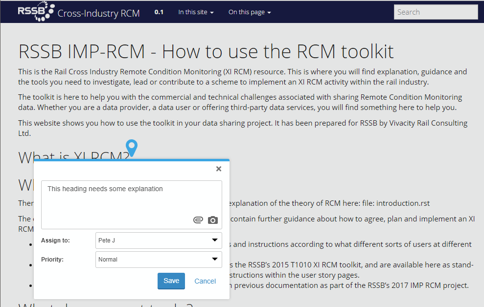
   
You can attach photos or screenshots or other files to you comment if you wish; and you can change its priority from the default "Normal" to "Low" or "High".

Markers
~~~~~~~

Once you have created your comment, you will see that a marker is left on the screen for it, and the PageProofer toolbar shows a number in the circle:

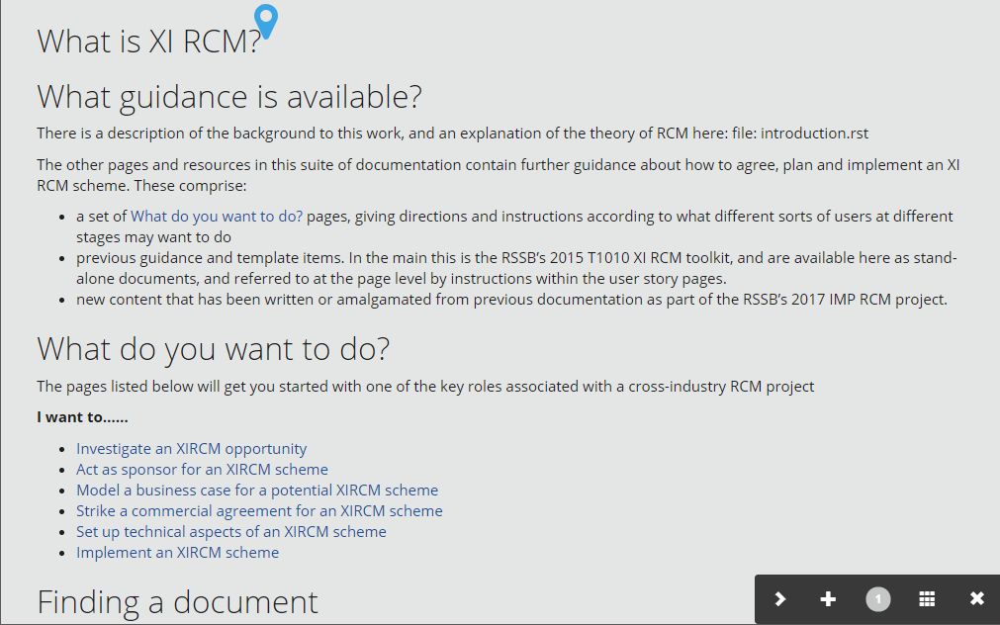
   
If you hover over the marker you will see a short description of the comment:

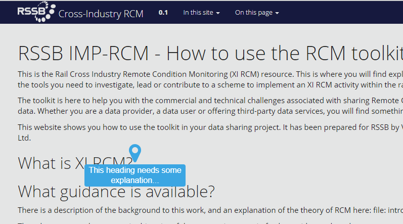
   
You can open the comment and add further comments at any time.

Dashboard icon
~~~~~~~~~~~~~~

Return to the Dashboard by clicking the grid icon in the PageProofer toolbar:

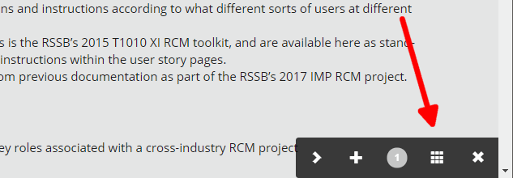
   
The dashboard now shows the new comment:

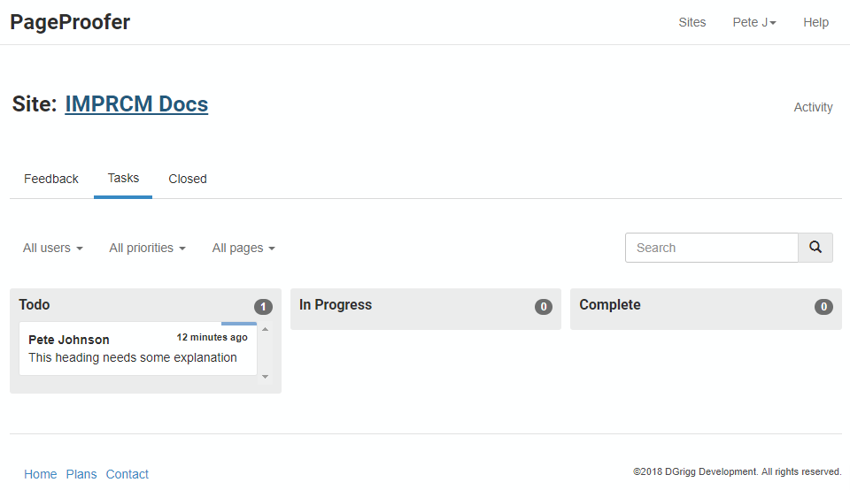


   
The Issue Process
-----------------

Comments that you make on the web pages are automatically recorded as issues on VRC's issue management tool in Github.  This means that they will be tracked and tackled using the same process as VRC use for any other project issues and code bugs.

Any comments made by VRC during work on the issue will automatically be added to the PageProofer comment as well and so will be visible to stakeholders.

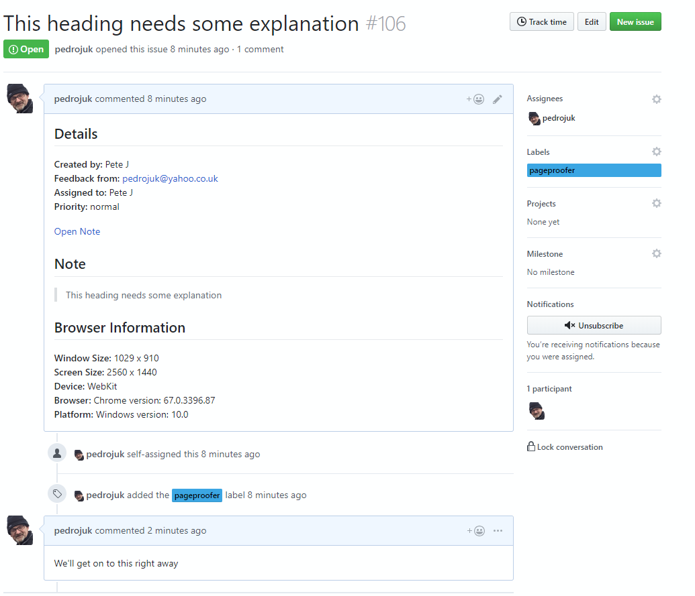

The screenshot above shows how the comment looks in the Github issue management system, with a new response from VRC.

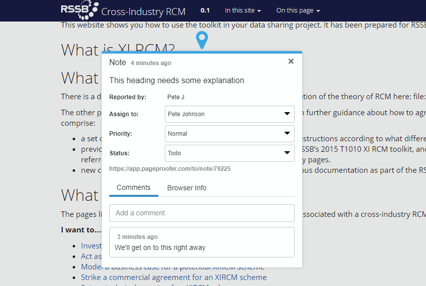

And the one above shows the VRC comment now appearing on the PageProofer on-screen comment.

Notifications
`````````````
You can set PageProofer to notify you of any new comment activity. From the PageProofer dashboard, click the dropdown by your user name in the navigation bar top-right, then the Notifications tab. You will see something that looks like this:

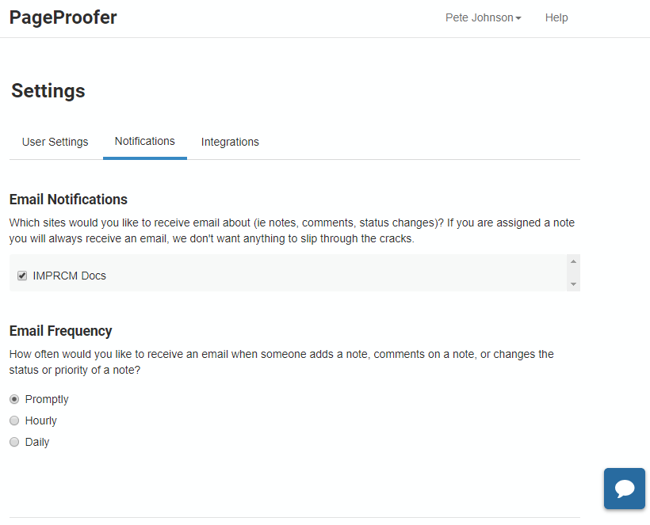

   


