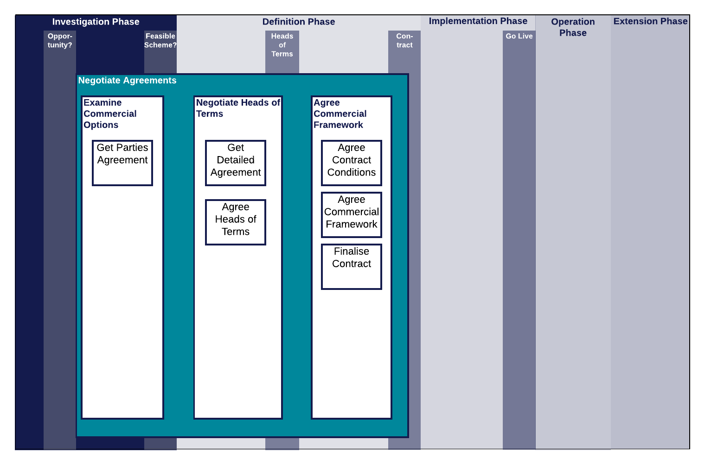

.. heading sequence */* = - ^ "

.. _strike-a-commercial-agreement-for-an-xircm-scheme:

***************************************
Negotiate agreements with stakeholders
***************************************

This page contains an overview of the process, documents and guidance that may be needed by someone working towards commercial agreements required for a Cross-industry RCM scheme.

Context
========

See :ref:`introduction-to-xircm` for a lay-person's guide to Cross-industry RCM.

.. figure:: https://www.lucidchart.com/publicSegments/view/5485ac24-b2f1-4591-8c44-b3306f9e6849/image.png
  :alt: Summary Cross-industry RCM overview
  :name: commercial_process_map_overview

  Cross-industry RCM Project Process Map - Overview

:numref:`commercial_process_map_overview` shows the Negotiate Agreements workstream in the context of the project phases and gateways and the other workstreams.  More detail on these aspects of a Cross-industry RCM project can be found in :ref:`scheme-process` and the pages devoted to the other workstreams.

Tasks
===================

  Negotiate Agreements Workstream

Examine Commercial Options
--------------------------
This initial task is a brainstorming / scoping effort carried out to see if there is a viable commercial framework available. It is dealt with in the :ref:`investigate-an-xircm-opportunity` page.

Negotiate Heads of Terms
------------------------
This task is carried out early in the Definition phase. The Heads of Terms is a non-binding understanding about the commercial principles that will be embodied in an agreement.

Agree Commercial Framework
--------------------------
This task represents all the work that needs to be done to reach a full contractual agreement between parties.

.. _guidance:

Guidance
=========

T1010 provides guidance and templates to support the tasks above.  The documents list the decisions that need to be taken at the Heads of Terms and Contract stages and give some help on to how to complete them.

Commercial Decisions Matrix
-------------------------------
This is a  :ref:`matrix of all commercial considerations<Matrix-of-Commercial-Considerations>` to determine in outline the decisions required for an XI RCM scheme as it progresses towards contractual agreement. For each scheme, items on the matrix may or may not be required for the heads of terms, and for the full contract.  Items can be marked as required or not, responsibility for each item can be assigned, and decisions can be recorded in the matrix itself. The Commercial Guidance page provides guidance for all of these items.

Download the template from here: :download:`Commercial Decisions Matrix Template <_static/downloads/templates/Commercial_Decisions_Matrix_template.xlsx>`

Commercial Guidance
-------------------------------
The :ref:`commercial guidance page <Commercial-Guidance>` contains guidance for all of the decisions listed in the Commercial Decisions matrix at the outset of work towards commercial agreement.

.. _heads-of-terms:

Heads of Terms
----------------
The heads of terms to the scheme will be formed by the answers in the :ref:`Commercial Considerations Matrix <Matrix-of-Commercial-Considerations>`. A word template for a Heads of Terms document was developed for use with the IMPRCM case study, and can be downloaded here.

Download the template from here: :download:`Heads of Terms Template<_static/downloads/templates/Heads_of_Terms_Template.docx>`

.. _full-contract-and-schedules:

Full Contract and Schedules
--------------------------------------------
A template contract and schedules for a Cross-industry RCM scheme is available to use.  This is the output of previous research project T1010 02 - Appendix E to the report. Note the principles linked to below; the template is not intended to be a fully developed agreement but includes modules covering a range of alternative approaches that can be chosen by the parties to suit different types of RCM activity and different cross-industry relationships.

Download the template from here: :download:`Contract and Schedules Template <_static/downloads/templates/Remote_Condition_Monitoring_Agreement_and_Schedules_template.odt>`

Principles of use for T1010 02 template contract
--------------------------------------------------

These commercial principles, taken from the report from the T1010 02 project, explain how the template should be used:   :download:`T1010 02 Report <_static/downloads/templates/2015-03-report-t1010-RCM-commercial-report.pdf>`

- The templates were not intended to be fully developed agreements but would include modules covering a range of alternative approaches that can be chosen by the parties to suit different types of RCM activity and different cross-industry relationships
- The templates were planned to target agreements between parties interested in common endeavour (and thus appropriate for immediate application to current initiatives) and not the ‘cloud of data’ concept where other parties can ‘reach in’ (a future ambition)
- An overall scheme may involve multiple parties with a single agreement or, more likely, multiple agreements some of which will be bilateral supply or service agreements. The templates are intended to have multiple uses
- Where purely commercial supply or service agreements are based on existing company terms of supply then certain of the template modules may still be used in schedules to ensure obligations still flow back-to-back between the parties
- At an early stage preliminary Heads of Terms might be agreed pending full development of the concept and the business case (which could themselves require considerable inputs)

Supporting Documents for the template contract
---------------------------------------------------------

Other outputs from T1010 02 are available for reference.

- :download:`T1010 02 Report <_static/downloads/templates/2015-03-report-t1010-RCM-commercial-report.pdf>` - including Commercial Principles, Key Features & Recommendations.
- :download:`T1010 Appendix F  <_static/downloads/templates/2015-03-report-t1010-RCM-commercial-report.pdf>`  - the "How To" for the contract document itself.

.. Gill note that you can put lower-level TOC trees in documents just to list the pages that they should link to. You can also provide different text for the links as I have done for this one.

.. .. only:: html

   .. toctree::
     :titlesonly:

     contract
     contract_how
