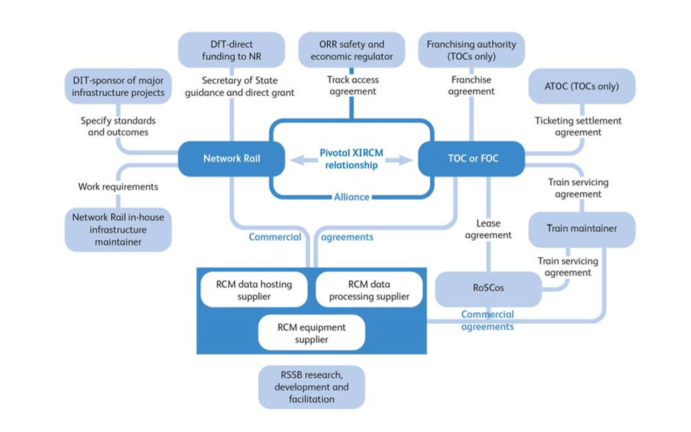

.. _commercial-guidance:

Commercial Guidance
========================

.. .. todo:: Asset Protection agreement - define responsibilities and extract more from Commercial Principles section 5

.. .. todo:: alliance risk reward not part of contract but key to t1010 02 steps - or not? definition of "who gains what" needed.

This page contains guidance for working towards :ref:`heads-of-terms` and :ref:`full-contract-and-schedules`.

It comprises:

* a description of each decision required in the :ref:`Matrix-of-Commercial-Considerations` template which will form the basis of an agreement
* a link to the source material from the T1010 project
* any relevant additional reading

How to use the Matrix of Commercial Considerations template
---------------------------------------------------------------------
The :ref:`Matrix-of-Commercial-Considerations` template and this page of guidance is intended to be used at the outset of a scheme to provide the reader with an understanding of the scale and scope of required work.

The exact requirements for a contract, and to some extent for a heads of terms, will vary from scheme to scheme, and this matrix allows the user to select the relevant items, assign a responsibility and fill in any decisions or comments.   It should be therefore be noted here that the template contract and schedules, created in the T1010 research project, are intended to be used as a **starting point** for the final contract, and there is no requirement for the final agreement to correspond exactly to the template.

The remainder of this page comprises guidance for the decisions required in the matrix. 

.. _Objectives:

Objectives
-----------------
.. highlights::
   Precursor to Heads of Terms. There is no requirement for the objectives to be entered into the contract however a full understanding of the aims and objectives of all parties should be ensured at the outset of discussions.

A preamble is needed setting out the overall aims of the scheme. There may be multiple aims for different parts of the industry which need to be referred to, whether achieving maintenance efficiency gains, better performance or other improvements. The intention to achieve these aims by common endeavour of the parties to the agreement needs to be expressed. If there is to be an 'alliance' relationship with a risk/reward sharing mechanism this should also be mentioned. [#]_

.. rubric:: Footnotes

.. [#] Source: |cp2|_

.. _Parties and Governance:

Parties and Governance
--------------------------
.. highlights::
   There is no requirement for the information on parties to be entered into the contract however a full understanding of the responsibilities and requirements of those parties involved should be ensured at the outset of discussions.

For a data collection and sharing scheme to be successful there needs to be clarity on who is the promoter, who is supporting that and the roles and responsibilities of the different parties.
Roles identified include:

* Scheme Lead or Joint Scheme Leads (scheme promoter(s), who can be expected also to have other roles listed below)
* Suppliers: Equipment and software suppliers/installers/maintainers
* Data collectors/ hosters/ processors/ analysts/ distributors
* Data receivers/ users/ beneficiaries
* Scheme facilitators

The organisations fulfilling these roles can include Network Rail, other infrastructure owners such as HS1, TOCs, FOCs, ROSCOs, train manufacturers, train maintainers, monitoring equipment manufacturers, software houses, data hosting firms and technical consultants.  Scheme facilitators can also include governmental, regulatory and industry bodies with contractual of regulatory relationships with any of the above.

Figure 1, showing interested parties within the industry and their relationships, illustrates this item.

Where there are Joint Scheme Leads, provision may be needed for establishing a governance forum (management group) for scheme oversight including details of how decisions are to be taken. If an alliance is involved this forum would have oversight of the operation of the risk/reward mechanism. [#]_

.. rubric:: Footnotes

.. [#] Source: |cp1|_

.. _Business Case:

Business Case
-------------------
.. highlights::
   This information would not be required in the final contract however could be stated in the heads of terms, if necessary.

Where a scheme business case has not been completed prior to an agreement (or more likely a Heads of Terms agreement) being reached between the parties, the agreement may need to include reference to responsibilities of the parties for its completion. This may be at industry level and parallel business cases at the level of the individual parties involved (allocating contributions and benefits to them) will be an enabler for agreement to be reached. [#]_

.. seealso::

   :ref:`Guidance and templates<model-the-business-case-for-a-potential-xircm-scheme>` for the creation of an outline business case.

.. rubric:: Footnotes

.. [#] Source: |cp4|_

.. _Programme:

Programme
---------------
.. highlights::
   Programme can be recorded in the heads of terms and in schedule 3 of the full contract.

This should include programme for the supply and installation of equipment, and may include timescales for the supply or transmission of any data required. It may also include provisions relating to the schedule for monitoring condition of assets, for example regarding train-borne equipment, where particular units will be located, which areas of track this will monitor and over what timescale. [#]_

.. rubric:: Footnotes

.. [#] Source: |sch3|_

.. _Equipment:

Equipment
----------------
.. highlights::
   Equipment specifications can be recorded in the heads of terms and in schedule 2 of the full contract.

Equipment should be specified in the following ways.

Ownership and Use
~~~~~~~~~~~~~~~~~~~~~~
* Installation- what is to be installed, where and by whom.
* Who owns the installed equipment? Schedule 2 broken down to be more specific
* Who has permission to use the equipment? Schedule 2 broken down to be more specific
* Are there are any conditions relating to the removal or decommissioning of the equipment? Schedule 2 broken down to be more specific [#]_

.. rubric:: Footnotes

.. [#] Source: |sch2|_

Operation, maintenance and safety
~~~~~~~~~~~~~~~~~~~~~~~~~~~~~~~~~~~~~
* Specify the tasks required to accept the system, undertake system safety assessments, put the system into operation and keep the system operational (day to day system management and maintenance, including managing equipment servicing and warranties)
* Specify which parties are responsible for managing and undertaking these tasks
* Specify which parties are responsible for paying for these tasks, how much and when, including allocation of operating cost and other O&M risks to the parties best placed to mitigate and manage those risks.
* Specify any liabilities if any Equipment fails and has knock-on repercussions [#]_

.. rubric:: Footnotes

.. [#] Source: |cp6|_

Other
~~~~~~~~~
* Are any approvals required? Who will be responsible for gaining these, and by when? (Eg from bodies such ROSCOS, DfT, ORR)
* Should any industry standards apply to the equipment installation or operation?
* Is any asset protection agreement or similar arrangement required? [#]_

.. rubric:: Footnotes

.. [#] Source: |sch2|_ and |cp5|_

.. _Data:

Data
-----------
.. highlights::
   Data specifications can be recorded in the heads of terms and in schedule 2 of the full contract.

Details are needed of:

* the data required, including any metadata.
* data collection - by whom, with what frequency
* The steps required in the information lifecycle (including initial processing, cleansing, normalising and transmission) and who is responsible for each task
* Data provision - by whom, to whom, in what format, with what frequency and in what time
* Data storage - by whom, for how long, under what terms ?  .. todo:: what does records of the collected data mean? See schedule 2
* Levels of precision and accuracy
* Which parties are responsible for undertaking each of the data handling tasks
* Which parties pay for each of the data handling tasks, how much and when, including allocation of data handling cost/other data handling risks [#]_

.. rubric:: Footnotes

.. [#] Source: |sch2|_ and |cp7|_

.. _data-uses-sharing:

Data Uses, Sharing, IP
----------------------------------------------
.. highlights::
   Use of data and IPR can be defined in the Heads of Terms and in schedule 4 of the contract. Data sharing can be defined in the Heads of Terms and in schedule 2 of the contract.

Data Use and Sharing
~~~~~~~~~~~~~~~~~~~~~~
Details are required of:

* the intended ownership of data and of value added information at each stage made available post-processing.
* the expected use of the data at each stage by each party
* what data is to be shared with which parties and where ownership is transferred
* how data is to be shared and any protocols relating to data sharing [#]_

.. rubric:: Footnotes

.. [#] Source: |cp8|_

.. seealso::

   Also see the :ref:`Principles` section below.

IP (Intellectual Property) Rights
~~~~~~~~~~~~~~~~~~~~~~~~~~~~~~~~~~~~~
Details are required of title to data and licensing of IPR agreements.

Title to data - three options are described in schedule 4 of the contract.

OPTION 1 – to be used where a particular Party retains all IPR to the Data as it is recorded – perhaps with licence to another Party for various purposes (see below)]

OPTION 2 – title to the original Data remains vested in a particular Party, but another Party has title to any modifications or improvements or processed output made in respect of the Data]

OPTION 3 – title to IPR developed or created in the course of the Agreement, to be owned by the party that developed or created the IPR

Licensing of IPR - two options are described in schedule 4 of the contract, for the granting of a licence of IPR for a permitted purpose.

OPTION 1 - Permitted Purpose means for any and all purposes, including to improve and/or modify such Intellectual Property Rights.

OPTION 2 - Limited license to use the Data for a particular purpose only [#]_

.. rubric:: Footnotes

.. [#] Source: |sch4|_

.. _Principles:

Principles
~~~~~~~~~~~~
The principles suggested to be put in place for this are:

* Raw data:

  - should remain the intellectual property of the party for whom it is collected (that is normally the organisation responsible for the assets being monitored, whether it is a TOC, FOC, manufacturer, maintainer or infrastructure owner), even though it is considered that raw data should generally be shared freely within the industry given appropriate licensing conditions (see below)
  - may not be ascribed value other than the allocated cost of collecting it

* Processed information:

  - should become the intellectual property of the party for whom the data is processed (in whom IPR should rest)
  - may be ascribed value in addition to the allocated cost of processing where it enables demonstrable net savings or value added, so leading to net industry costs being reduced

* Data sharing:

  - the principle proposed is that data ownership is not transferred but that the sharing is by means of a licence to receive and use the data for specified purposes (to be described) and subject to non-disclosure agreement (NDA) terms to be set by the owner.
  - any further processing by a party with whom the data has been shared, and any subsequent sharing with further parties, should then be subject to the same conditions and limitations. [#]_

  .. rubric:: Footnotes

  .. [#] Source: |cp8|_

.. _Payments:

Payments
--------------
.. highlights::
   The principles should be recorded in the Heads of Terms. The amounts, payment arrangements and other terms should be defined in schedule 5 of the contract.

Principles of Charges
~~~~~~~~~~~~~~~~~~~~~~~~~
Agree the principles of charging for the Heads of Terms:

- who is going to pay whom for what
- on what basis are the costs for raw / processed / augmented data to be decided?
- what payments are required for equipment supply and installation
- what payments are required for equipment maintenance and operational - either time based or on another basis
- is payment required for software development

Details of Charges
~~~~~~~~~~~~~~~~~~~~~
For the full contract agree the amounts and timeframes for charging for:

- Data
- equipment supply and Installation
- equipment maintenance and operation
- software

Agree allocation of risk

.. todo:: more guidance needed on agree allocation of risk - to be updated following  IMPRCM legal and commercial workstream progress

Agree terms on general items - refunds, invoicing, terms [#]_

.. rubric:: Footnotes

.. [#] Source: |sch5|_

.. _Service Level Agreements:

Service Level Agreements
------------------------------------
.. highlights::
   Service level agreements should be considered in the heads of terms and fully defined in Schedule 6 of the contract.

Details are required of the levels of service agreed between the service providers and the users or beneficiaries. These are likely to relate principally to data or processing.  The extent of detail required is most likely to be proportional to the size, scale and importance of the project and the level of investment/payment involved.  If the size of the agreement is small or the Parties are not paying each other for data, there may not be an SLA.

Recommended items for consideration within a service level agreement:

* Availability
* Timeliness (or frequency)
*	Quality (integrity, precision, accuracy)
*	Transfer dependability
*	Security
*	Fault tolerance
*	Response times

In addition, it may be advisable to define what should happen if anything goes wrong:

*	Steps to be taken in response to any service delivery issues
*	Escalation procedures
*	Compensation for downtime
*	Disaster recovery

Parties should also consider whether a performance regime may be appropriate, and what remedies there may need to be for any failure to meet the Specification – for example, liquidated damages, increased monitoring, remedial plans, liability caps for breach etc. [#]_

.. rubric:: Footnotes

.. [#] Source: |cp9|_ and |sch6|_

.. _Insurance and warranty:

Insurance and Warranty
----------------------------
.. highlights::
   Any insurance or warranty arrangements should be defined in Schedule 7 of the contract.

As a principle it is not generally accepted that data that is shared by an owner with another party should carry any level of warranty. This is particularly the case with raw data. It is believed that the only duty on the owner is to be open with the receiving party about the source of the data and methods used to collect it. The view is taken that parties with responsibilities in the rail industry are sufficiently knowledgeable to assess the data and the risks around it and to take responsibility for any use to which they put it.

When the Commercial Principles were put in place for the creation of the template contract, there was] no information on insurances being employed specific to Cross-industry RCM schemes but provision could be made for clauses adaptable to any perceived needs. [Similarly there was] no information on limitations on liability being applied in Cross-industry RCM schemes but these are expected to be in place on many commercial contracts and provision can be made for suitable clauses to be made available.

The contract schedule 7 allows for the following liabilities to be entered:[#]_

* Product
* Third party
* Employers

.. rubric:: Footnotes

.. [#] Source: |cp10|_ and |sch7|_

.. _Alliance Risk / Reward:

Alliance Risk / Reward
-------------------------------------------
.. highlights::
   Any targets or risk allocation relating to a risk / reward arrangement can be entered in Schedule 1 of the contract.

While in usual rail industry business, commercial agreements will set out the services being supplied and costs and risk allocations, there are good reasons for more collaborative commercial arrangements to be entered into in certain circumstances. Examples include the Wessex alliance, bringing SWT and NR Wessex Route together in a shared risk and reward model intended to drive up such things as efficiencies and performance.

In such arrangements, the targets are set out, as are how to share the risks and rewards of achieving, exceeding or underperforming those targets. Cross-industry RCM schemes, with clear aims for outcome improvement could also be incentivised in this way. Provision can be made in the template agreements for clauses that would enable alliance arrangements (unspecified) to be covered. [#]_

.. rubric:: Footnotes

.. [#] Source: |cp11|_

.. _Term & Franchise End:

Term & Franchise End
--------------------------------------------------
.. highlights::
   Any terms should be defined in Schedule 1 of the contract.

Depending on the nature of the scheme and its intended longevity, it may be desirable to identify with the franchise authority arrangements to allow carryover of a scheme into the next franchise. It has been suggested that this might be overcome by having the equipment provision added to the requirements of the track access agreement or train service agreement - this making it feature in the data room when a franchise competition occurs. [#]_

.. rubric:: Footnotes

.. [#] Source: |cp12|_

.. _Disputes and Termination:

Disputes and Termination
---------------------------------------------
.. highlights::
   Any terms should be defined in Schedule 1 of the contract.

Suitable arrangements for resolving disputes and for termination, consistent with industry norms, will be needed along with specific provisions for decommissioning equipment. [#]_

.. rubric:: Footnotes

.. [#] Source: |cp13|_

.. the footnotes all collected together
.. commercial principles
.. |cp1| replace:: T1010-02 Commercial Principle 1 (Organisation and Parties)
.. _cp1: _static/T1010/T1010-02/2015-03-report-t1010-RCM-commercial-report.pdf#page=41

.. |cp2| replace:: T1010-02 Commercial Principle 2 (Objectives)
.. _cp2: _static/T1010/T1010-02/2015-03-report-t1010-RCM-commercial-report.pdf#page=41

.. |cp4| replace:: T1010-02 Commercial Principle 4 (Business Case)
.. _cp4: _static/T1010/T1010-02/2015-03-report-t1010-RCM-commercial-report.pdf#page=42

.. |cp5| replace:: T1010-02 Commercial Principle 5 (Initial Investment, Renewals)
.. _cp5: _static/T1010/T1010-02/2015-03-report-t1010-RCM-commercial-report.pdf#page=42

.. |cp6| replace:: T1010-02 Commercial Principle 6 (System Operation, Maintenance)
.. _cp6: _static/T1010/T1010-02/2015-03-report-t1010-RCM-commercial-report.pdf#page=42

.. |cp7| replace:: T1010-02 Commercial Principle 7 (Data Collection, Processing, Hosting, Transmission)
.. _cp7: _static/T1010/T1010-02/2015-03-report-t1010-RCM-commercial-report.pdf#page=43

.. |cp8| replace:: T1010-02 Commercial Principle 8 (Data Ownership (IPR), Sharing, Usage and Confidentiality (NDAs))
.. _cp8: _static/T1010/T1010-02/2015-03-report-t1010-RCM-commercial-report.pdf#page=43

.. |cp9| replace:: T1010-02 Commercial Principle 9 (Service Level Agreements)
.. _cp9: _static/T1010/T1010-02/2015-03-report-t1010-RCM-commercial-report.pdf#page=44

.. |cp10| replace:: T1010-02 Commercial Principle 10 (Warranties, Insurances, Liability Caps)
.. _cp10: _static/T1010/T1010-02/2015-03-report-t1010-RCM-commercial-report.pdf#page=44

.. |cp11| replace:: T1010-02 Commercial Principle 11 (Alliance Risk and Reward Arrangements)
.. _cp11: _static/T1010/T1010-02/2015-03-report-t1010-RCM-commercial-report.pdf#page=45

.. |cp12| replace:: T1010-02 Commercial Principle 12 (Term of Agreement, Franchise-end Provisions)
.. _cp12: _static/T1010/T1010-02/2015-03-report-t1010-RCM-commercial-report.pdf#page=45

.. |cp13| replace:: T1010-02 Commercial Principle 13 (Disputes, Termination, Decommissioning)
.. _cp13: _static/T1010/T1010-02/2015-03-report-t1010-RCM-commercial-report.pdf#page=45

.. contract schedules
.. |sch2| replace:: T1010-02 Contract Template Schedule 2 (Specification)
.. _sch2: _static/T1010/T1010-02/Appendix_E_Remote_Condition_Monitoring_Agreement.pdf#page=20

.. |sch3| replace:: T1010-02 Contract Template Schedule 3 (Programme)
.. _sch3: _static/T1010/T1010-02/Appendix_E_Remote_Condition_Monitoring_Agreement.pdf#page=22

.. |sch4| replace:: T1010-02 Contract Template Schedule 4 (Data Ownership and IP)
.. _sch4: _static/T1010/T1010-02/Appendix_E_Remote_Condition_Monitoring_Agreement.pdf#page=23

.. |sch5| replace:: T1010-02 Contract Template Schedule 5 (Payments)
.. _sch5: _static/T1010/T1010-02/Appendix_E_Remote_Condition_Monitoring_Agreement.pdf#page=25

.. |sch6| replace:: T1010-02 Contract Template Schedule 6 (Service Level Agreement)
.. _sch6: _static/T1010/T1010-02/Appendix_E_Remote_Condition_Monitoring_Agreement.pdf#page=27

.. |sch7| replace:: T1010-02 Contract Template Schedule 7 (Insurance)
.. _sch7: _static/T1010/T1010-02/Appendix_E_Remote_Condition_Monitoring_Agreement.pdf#page=28
