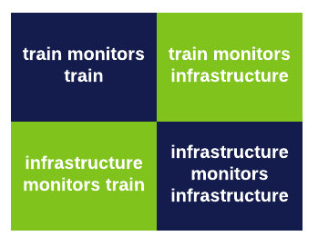
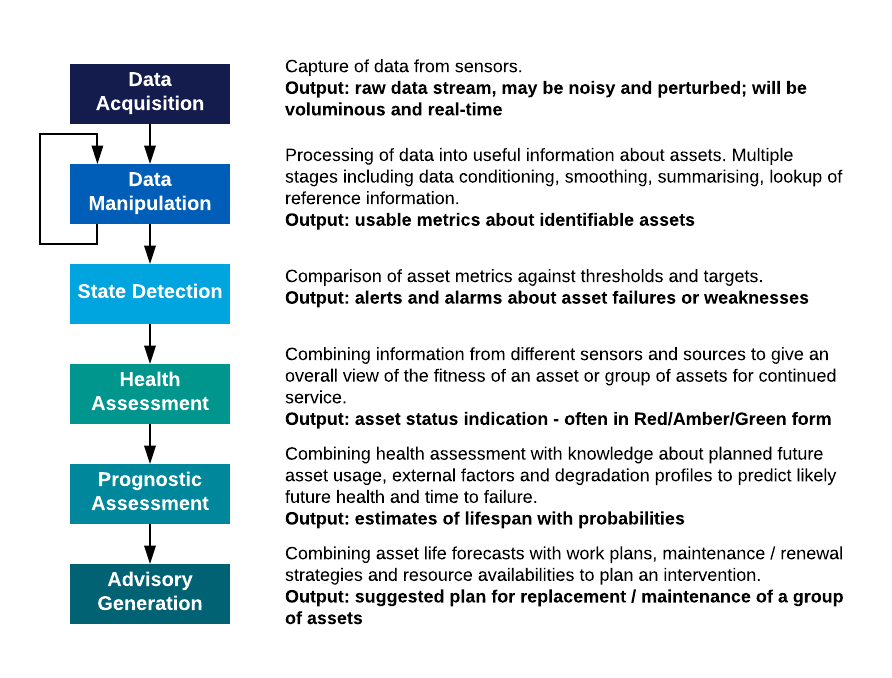
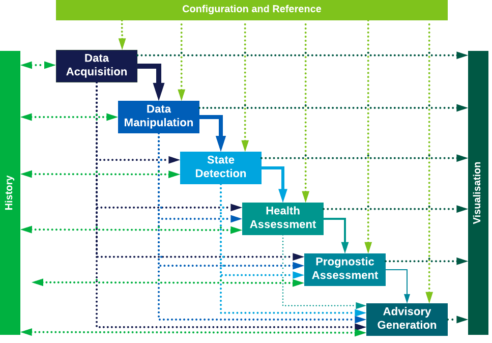

.. heading sequence */* = - ^ "

.. _introduction-to-xircm:

**************************************
Introduction to Cross-industry RCM
**************************************

This page is an introduction to Cross-Industry Remote Condition Monitoring (:term:`XIRCM`) for general readers and people new to the field. It covers:

- :ref:`what-is-xircm` - general definition of Cross-industry RCM and why it has particular problems which have limited its take-up.
- :ref:`intro-current-schemes` - notes on some examples of Cross-industry RCM.
- :ref:`intro-industry-initiatives` - where Cross-industry RCM fits in to work being done by industry to meet future challenges.
- :ref:`intro-t1010` - the guidance and standards toolkit developed by the Cross-Industry RCM Strategy Group (:term:`XIRCMSG`) to tackle impediments to Cross-industry RCM take-up.
- :ref:`intro-key-concepts` - an introduction to some of the important concepts used in the toolkit to support a standard approach to Cross-industry RCM schemes.
- :ref:`intro-where-next` - suggestions on where to go for more information.

.. _`what-is-xircm`:

What is Cross-Industry RCM?
============================

RCM - Definitions
-----------------

In Remote Condition Monitoring (RCM), the health of an asset is observed by sensors which transmit their readings back to an office-based :term:`IT` system. By processing the readings, the system can warn of actual or incipient failure of the asset and trigger maintenance / repair actions.  

The potential advantages are well-recognised:

- continuous monitoring of the asset, rather than periodic inspection, potentially leading to earlier diagnosis of degradation or faults
- reduction of need to expose staff to dangerous on-track conditions
- a store of information which can be processed to improve understanding of asset behaviour.

Railway assets fall into two categories - fixed **infrastructure** and moving **trains**. :numref:`rcm-quadrant` below shows four typical scenarios for rail industry RCM - where the asset being monitored is an infrastructure or train one; and whether the monitoring is done from infrastructure-mounted or train-borne sensors.

  Rail RCM Quadrants

By "Cross-industry RCM" we mainly mean the two green quadrants: the scenarios which straddle the rail/wheel interface - train-borne equipment monitoring infrastructure, or track-side equipment monitoring trains. 

These warrant particular attention because they have turned out to be much harder to achieve than the blue quadrants. The large potential benefits they offer the industry have yet to be realised. The blue scenarios, by contrast, are now commonplace: much critical infrastructure is fitted with remote sensors and all new trains monitor their own condition.

.. _`intro-current-schemes`:

Some Examples of Current Cross-industry RCM Schemes
-----------------------------------------------------

- |railbam| is an example of infrastructure monitoring trains. A trackside array of microphones records the sound profile of vehicle bearings as the train passes it. Software analyses the acoustic fingerprint and can detect a variety of bearing wear scenarios, allowing them to be corrected before expensive and dangerous bearing failure. When coupled with Automatic Vehicle Identification (:term:`AVI`) and a suitable vehicle database, the software can detect gradual degradation and generate maintenance work orders at appropriate times.
- |ugms| (:term:`UGMS`) is an example of trains monitoring infrastructure. Equipment mounted on rail vehicle bogies contains accelerometers and other sensors to measure track geometry. Readings are transmitted back to the ground with associated location information (:term:`GPS` or other location sources available to the train). Ground-based software detects significant anomalies and generates alerts; or can consolidate multiple readings over the same piece of track to improve resolution and accuracy and assess the change in track condition over time.

.. _`intro-problems`:

Problems with Cross-industry RCM
------------------------------------

Research work such as that done by the :term:`XIRCMSG` (see :ref:`xircmsg`) has exposed the types of problem that impede the take-up of Cross-industry RCM, even where a clear business requirement exists. These fall into these main categories:

- **business case**: it is hard to make a business case where one set of industry parties picks up the costs of a scheme but its benefits accrue to other parties
- **legal and commercial**: problems clarifying who owns the data, where do :term:`IP` rights lie in the processes applied to it, where does liability lie for deficiencies in the data, what principles should apply to the use and further exploitation of the data
- **organisational**: who is in charge of the scheme and who needs to actually carry out tasks associated with it, including those associated with providing, maintaining and disposing of equipment; gathering, storing and transferring the data; and applying the data to improve business decisions.
- **technical**: how best to make data easy to use and easy to combine with data from other industry sources; how to support novel uses of the data; how best to ensure consistency of processing and interpretation across data from different sites, different suppliers and gathered at different times.

.. _`intro-industry-initiatives`:
 
Industry Initiatives
===============================

Cross-industry RCM's problems reflect the need for more system-wide thinking that industry analysts see as necessary to drive the safety, capacity, availability and value-for-money improvements the railway needs to deliver.  

:ref:`rvms-mcnulty`, commissioned to identify why the UK's railway was more expensive than comparators on the European mainland and slow to innovate, identified the lack of best practice in asset management as an industry weakness that needed to be addressed. To drive a 30% improvement by 2018/19, a *"whole-system, whole-life"* approach was recommended. The study also recommended a focus on better cross-industry information systems.

Looking more long-term, :ref:`rail-tech-strategy` (:term:`RTS`) has a strategic 30-year goal to meet increasing demands on the railway by more radical change in philosophy. Several of its workstreams include the expansion of Cross-industry RCM use to help deliver them: infrastructure and rolling-stock maintenance moving to a more condition-based approach; IT changes to support integration, sharing and novel exploitation of RCM data.

Already in place at the time the :term:`RTS` was written, and key to its delivery, is the :ref:`XIRCMSG`, a group tasked with leading the industry's efforts to facilitate Cross-industry RCM. The group has investigated in depth the impediments to Cross-industry RCM; its response was to commission :ref:`intro-t1010` to provide a toolkit setting out a structure, standards and guidance to help project practitioners assess the business case for their Cross-industry RCM scheme, make the necessary commercial arrangements and set up the technical aspects in a standards-compliant way. This website is supplementary guidance in the use of that toolkit.

Following the T1010 project, :term:`XIRCMSG` sponsored :ref:`intro-IMPRCM` to try out aspects of the T1010 toolkit in a real Cross-industry RCM project and deliver:

- additional guidance in the use of the toolkit, including best practice and experience gained (this website)
- a prototype data broker exhibiting the technical approach and standards proposed, to act also as a demonstrator of the capability to industry.

To implement the objectives of the :term:`RTS`, the industry set up the :ref:`capability-delivery-plan` (:term:`CDP`). This has twelve key capabilities, two of which overlap strongly with Cross-industry RCM: **"More Value from Data"** and **"Minimal Disruption to Train Services"**.  :ref:`intro-IMPRCM` will be liaising closely with the teams responsible for delivering these capabilities.  This has now been rolled into Network Rail's research programme for :term:`CP6`.

.. _intro-t1010:

The T1010 Project
===============================

:term:`RSSB`'s research project :term:`T1010` comprised four work packages, each delivering a report giving guidance and suggested standards for one of the aspects of Cross-industry RCM previously identified as being problematic. Exploratory work investigated existing Cross-industry RCM projects, existing RCM projects within industry sectors, approaches used in other industries and in the rail industry elsewhere and emerging information technologies; then four reports were produced:

- T1010-01: data architecture. A set of standards, guidelines and a suggested IT approach for interchanging RCM data between different parties, respecting their IP but maximising the openness and therefore future exploitability of the data.
- T1010-02: commercial / legal architecture. A process map and list of commercial principles, supplemented by a template contract and schedules, intended to assist parties in striking agreements for the provision, processing and use of Cross-industry RCM data.
- T1010-03: guidance and standards. An overview of the process needed to start, progress and complete a Cross-industry RCM scheme and of the existing standards and constraints that it would need to comply with.
- T1010-04: business case toolkit. A spreadsheet-based model and guidance to help quantify the overall business case and the party-specific business case for data-interchanging parties. This would indicate whether the scheme was at all viable and also provide a basis for commercial negotiations to address the issue that costs would likely be borne by one party but benefits accrue to another.

Although the main focus of the Toolkit is on the green quadrants in :numref:`rcm-quadrant`, projects in the other two blue quadrants can also suffer similar challenges and thus potentially benefit from applying its guidance.

This website represents additional guidance at an overview level, above the detail present in the T1010 documents.

T1010 documents themselves can be accessed via the Reference area here: :ref:`t1010-docs`.

.. _intro-IMPRCM:

The IMPRCM Project
====================

.. todo:: add links to requirements

A recommendation of the T1010 project was that the approach should be tried out and the data principles prototyped in an actual small-scale Cross-industry RCM project to see if they were fit for purpose. 

Stakeholders :term:`TfL` and Network Rail Western Route identified a possible target project: the exchange of condition data about Network Rail track gathered by :term:`UGMS` equipment mounted on Crossrail Class 345 trains running on the Western route, from Paddington initially to Heathrow Airport Junction but later to Reading.

A preliminary scoping exercise was carried out by :term:`RSSB` to see how much of the T1010 toolkit would be useful for this project. Nearly all the commercial principles could be examined and the template contract tried; a large proportion of the technical approach and standards could be trialled; and the process guidance could be adapted to fit a project of this size. The business case toolkit could also be tried out, though the results would not impact the commercial arrangements because of the prototype nature of the work.

The resulting project is IMPRCM. The scope of the project includes:

- assisting the parties (chiefly NR Western Route and TfL) to scope the project, agree Heads of Terms and come to a commercial agreement
- developing a set of documentation to act as guidance for users of the T1010 toolkit (this website)
- building a prototype data broker, based on T1010 architectural principles, to mediate the exchange of data between :term:`TfL` and :term:`NR` Western Route
- carrying out a gap analysis between the current T1010 toolkit and the approach best fitting the pilot project, to identify scope for updating the toolkit and guidance
- demonstrating the benefits of the approach used to an industry body.

.. _`intro-key-concepts`:

Key Principles of the T1010 Advice
====================================

The T1010 toolkit was put together to address reasons why Cross-industry RCM schemes have not taken off as well as desired. The reasons have been outlined above in :ref:`intro-problems`: they relate to the difficulties associated with industry fragmentation and siloisation. 

Underpinning the guidance and standards defined in the 4 workpackages of :term:`T1010` are a number of principles which all try to address this fragmentation. They can be divided into Commercial and Technical principles.

Additionally, some Philosophical Principles underpin the Cross-industry RCM goals.

Philosophical Principles
-------------------------

.. .. todo:: Reference these ideas which are not really brought out in T1010 but seem to be critical to the Cross-industry RCM goals. These need some work, but they feed into the Commercial and Technical principles.

- data is presumed to be owned by the party sponsoring and paying for its collection
- liability should not attach to the data supplier for anything done with the data
- data supply should be accompanied by best estimates of its accuracy and precision, but data processors / consumers must deal with any deficiencies
- licensing restrictions should not be onerous and should not restrict novel use
- as far as possible, data should be freely accessible to any downstream users
- IP in data processing techniques can be safeguarded

Commercial Principles
---------------------------------
The Commercial / Legal thread of T1010, T1010-02, set out a list of 13 commercial principles which the agreements between stakeholders should respect. The premise is that by adopting these principles, parties will save themselves effort, safeguard their interests and support future extension and enhancement of their schemes and other industry-wide ones.

The commercial principles are all referenced in :doc:`commercial_guide`. The gist of them is clear identification of:

- the parties involved and their roles and responsibilities
- the requirements for the data: content, quality and delivery arrangements
- the stages and gateways in the project lifecycle
- the ownership and license arrangements for data at all stages of its lifecycle
- who pays what and for what: equipment, data, storage and processing, maintenance, disposal.

.. _`intro-tech-principles`:

Technical Principles
----------------------------------
The Technical thread of T1010, T1010-01, sets out the principles to be followed in the data interchange. The goal here is to standardise as far as possible, to minimise the effort needed to develop a new data source, and to support the philosophical and commercial principles.

The key technical principles at work are:

- open and standard human-readable data formats. Data must be presented to consumers in plain text formats - :term:`CSV`, :term:`JSON` or :term:`XML` - or a standard :term:`MIME type` for audio or video media or similar.
- data must be easy to use - by end users using standard desktop software (e.g. MS-Excel or MS-Access); by analysts using standard analytic software (e.g. :term:`MATLAB`, :term:`Stata`, :term:`R` or :term:`Python/Pandas`); or by downstream computer systems using a :term:`REST`-based :term:`API`
- standard encodings for common data items: :term:`ISO` standards for dates, times, :term:`GPS` locations; railway standards for rail track locations, asset identifiers and operational data
- use of existing standards for rail data representation and transfer - including :term:`RailML` and :term:`RailTopoModel`.
- clear separation of RCM data (which is open) and RCM processing (which may be proprietary) according to the six-layer :term:`ISO 13374` model (see :ref:`intro-iso-13374` for an introduction).
- simple use of industry reference data and translation / mapping services available by standard lookup mechanisms
- :term:`metadata` available for all data in a standard format, providing information about data ownership, licensing, accuracy and precision so that downstream users know clearly what they can do with the data.
- support for a :term:`data broker`-based industry architecture to mediate data interchanges. This will make it easier for data providers, data processors and data users to interact in novel ways, support the adoption of standards and reduce marginal costs.

.. _`intro-iso-13374`:

The ISO 13374 model
---------------------

Principles
^^^^^^^^^^

ISO 13374 sets out to define a framework for the management of RCM in terms of data processing steps and data flows between them.  The steps cover the whole spectrum of involvement of RCM data, right from its initial capture ("Data Acquistion"), through the generation of alerts and alarms about asset failure ("State Detection" and "Health Assessment") up to the most forward-looking use in remedial / preventative planning ("Advisory Generation").

Each type of processing that RCM data undertakes can be categorised as belonging to one of the steps.  The steps can be:

- carried out by different parties or use different IT systems
- protected by :term:`IP` safeguards.

The steps should have:

- openly available definitions of what they do and how they do it
- clearly-stated limitations on the dependability of the data they produce
- service level specifications on availability, performance, latency

The data flows between the processing steps should:

- use open and standard data formats
- contain data appropriate to the processing step

   The ISO-13374 Processing Model

The processing steps are shown in :numref:`iso13374-stack` and described below. They represent a sequential hierarchy in which each step builds upon its predecessors. At each step through the hierarchy:

- the volume of RCM data reduces, generally by orders of magnitude
- the amount of contextual information about the assets and their role in the railway increases.

Typical current :term:`RCM` systems work internally at the first three levels - :ref:`intro-da`, :ref:`intro-dm`, :ref:`intro-sd` - and generate results at a basic :ref:`intro-ha` level. They do not generally give access to the more detailed data of the first levels, citing concerns about data volume and bandwidth, :term:`IP` and the difficulty of interpreting the data. They generally struggle to reach the higher levels - :ref:`intro-pa` and :ref:`intro-ag` - because of the difficulty in integrating data and business processes across different systems and different rail business domains.

The :term:`XIRCMSG`'s standardisation efforts aim to extend this typical structure in two ways using the :term:`ISO 13374` framework:

- to make data at the lower levels more readily available in standard forms so that novel uses can be made of it. This involves providing a technical framework and a contractual setup to address confidentiality and :term:`IP` concerns.
- to support efforts to reach the higher levels by lowering barriers to integration of data from other rail domains.

.. _`intro-da`:

Data Acquisition (DA)
^^^^^^^^^^^^^^^^^^^^^^
This is the first stage, where physical characteristics of the asset are converted to electronic signals by sensors. Many characteristics could be captured. Some examples:

- **acceleration**, captured by accelerometers. Used to detect misalignments or anomalies in, for example, track, :term:`OLE`, or vehicle wheels
- **noise**, captured by microphone. Used to detect wear in wheel bearings, for example
- **appearance**, captured by video camera. Used to detect missing components, uneven wear etc
- **temperature**, captured by thermometer or infra-red detector. Used to detect overheated wheel bearings etc

At this stage, the data readings are raw and subject to all kinds of noise and sensor misalignment / miscalibration and require processing to be of value in RCM. Also, they have little context: an accelerometer reading will have no knowledge of which piece of track or OLE it relates to; the timestamp associated with the data item may be inaccurate.

The data stream could be voluminous and occur continuously in real-time, particularly where the sensors are on vehicles and are monitoring the infrastructure. An important consideration is how much of this raw data stream is stored, and whereabouts is processing done to reduce its volume and extract meaningful information that can be transmitted from train to ground with the bandwidth available. There is value in preserving this raw data stream if possible, as it makes it possible to use it for new types of investigation in future.

.. _`intro-dm`:

Data Manipulation (DM)
^^^^^^^^^^^^^^^^^^^^^^
In this stage, the raw data stream is processed to make it useful for asset management purposes. This is generally a multi-step process, the steps being different for the different types of asset data.  Some typical steps are:

- **data cleansing**: removal or correction of anomalies caused by broken or malfunctioning sensors or data transmission glitches
- **calibration**: scaling the data values so that they match physical reality independent of the response of individual sensors
- **time correction**: adjusting for the differences between time recorded by the sensors and the actual time. (Sensors' clocks can drift and can suffer from other synchronisation issues including failure to account for Summer Time adjustments)
- **referencing**: attaching a track location (for infrastructure) or vehicle identity (for vehicles) to the data. This is an important topic, discussed in :ref:`intro-supporting-processes` below. Other contextualisation, such as providing information about the asset being monitored
- **aggregation**: summarising the data stream, such as by calculating totals, time-based averages, standard deviations or other statistical measures
- **trending**: looking for change over time
- **feature extraction**: picking the elements of the data that suggest the presence of anomalies.

Each of these steps requires the use of an algorithm or referencing process. Different parties may use different algorithms and different reference data sources which may not be current: this leads to lack of consistency in the data generated. There is thus scope for standardisation here, which the industry can support by:

- making standard services available to all RCM data users, e.g. for conversion from :term:`GPS` co-ordinates to track co-ordinates (:term:`ELR` / Track ID / yards or chains); or for vehicle identification.
- allowing data users to choose the algorithm they use from those provided by 3rd-party providers, by supporting a data broker which makes these readily available.
- standardising the presentation of metadata describing the algorithms and their characteristics and limitations.

In most current RCM systems, the processing and data associated with this stage are internal and not accessible to analysts or data owners; and the algorithms used are often perceived to be proprietary.  However, one of the main goals of the Cross-industry RCMSG effort is to reassure data processors that they can make data at this level available while protecting the :term:`IP` associated with the algorithms and processes.

The output of this stage is conditioned data that can be used to make decisions about the status of assets.

.. _`intro-sd`:

State Detection (SD)
^^^^^^^^^^^^^^^^^^^^^^

In this stage, the data readings from the DM step are compared with boundary values or thresholds to determine whether they represent normal or abnormal state.  The comparisons may result in

- indicators of state (OK / near threshold / over threshold)
- indicators of level of exceedence of threshold
- indicators of rate of change
- comparators against expected levels given by e.g. "bathtub" curves.

The thresholds or boundaries will be set by human intervention and may be refined over time as the knowledge of asset behaviour improves. A key issue here is ensuring that the volume of triggers generated is appropriate: enough to enable asset performance to be improved; not so many that they can't be handled by operators.

.. _`intro-ha`:

Health Assessment (HA)
^^^^^^^^^^^^^^^^^^^^^^

The job of this stage is to assemble State and other data from the various sensors associated with an asset to come up with an overall view of its condition. This may involve logic to resolve differences of opinion from different sensors on the same asset or to embody professional knowledge on its fitness for service although sensors indicate cause for concern.

In the Business Case tool described in T1010-04, this level is divided into two - **HA-1** and **HA-2** [#]_. 

- **HA-1** is a basic level of analysis in which different sensors on the same asset are combined - for example :term:`HABD` and acoustic readings of the same bearing.
- **HA-2** is a more advanced level, in which sensors on different assets in a group or assembly are combined to give a view of the health of the whole assembly.

The output of this process is alerts and alarms about the capability or fitness for service of the asset or assembly.  These may include indications of the likely fault condition or failure mode, with probabilities and explanation of the findings.

Most existing :term:`RCM` systems generate output for their users at the HA (typically HA-1) level: they report on the health of assets and generate alerts or alarms for action by asset users / maintainers.

This is an area where asset owners may see sensitivity, not wishing to divulge to 3rd parties or their competitors the ways in which their products are prone to fail. It is also an area where industry-wide efforts to maximise the benefits of Cross-industry RCM will require standardisation of failure modes and fault-type coding.

.. _`intro-pa`:

Prognostic Assessment (PA)
^^^^^^^^^^^^^^^^^^^^^^^^^^^

In this stage, forecasts of the asset's future performance are generated from the asset's current state (from the HA stage), knowledge about the degradation rates, and estimates of future degrading factors such as usage or weather. The assessment may include:

- likely asset health at future dates
- likely time of failure
- likely failure mode(s)

and could be accompanied by probability distributions, confidence limits, explanations of the logic used.  

This is the level at which condition-based maintenance of assets becomes a realistic possibility and so should be seen as the medium- to long-term goal of Cross-industry RCM efforts. It requires integration of data from different railway domains and external data sources in order to become effective:

- future asset usage for railway assets is driven by the timetable and resource plans (from the operational domain) 
- the industry cost of asset failure or degradation depends on the expected impact on passengers and freight customers (from the commercial domain)
- degradation also depends on external influences such as weather (temperature / sunshine / rainfall / wind / storm surge) and tide.

It also requires a good understanding of the expected deterioration rates and characteristics of assets by their type, age, usage and maintenance history. This type of understanding is patchy and incomplete.

Both these requirements need industry support to make the data flows readily accessible and to support the accumulation of knowledge of asset behaviour.

.. _`intro-ag`:

Advisory Generation (AG)
^^^^^^^^^^^^^^^^^^^^^^^^^^^
This is the highest level of the stack, in which data about the future health of assets from the PA level is merged with contextual data which could include:

- means of maintenance and repair
- costs and impacts of the possible failure modes and different interventions
- availability of money and physical resources

to come up with an optimal remedial plan. It requires the highest level of data integration and the most radical re-work of business processes in order to be effective.

The output of the process is a set of recommended actions or alternative plans, with justifications. These may be interfaced automatically to maintenance planning or workbank systems.

.. _`intro-stack-context`:

Context
^^^^^^^^^

:numref:`iso13374-detail` shows the processing blocks of the six-stage hierarchy in context, with data flows between them and other supporting sub-systems.

   ISO 13374 - Links and Context

The subsystems are:

- **Configuration and Reference**. Each of the processing blocks needs supporting information about its own situation, the assets it is associated with, its observed own state of health, its calibration, its physical connections with others. These are held in a configuration block
- **History**. Past data about asset condition needs to be stored to make it available to calculate statistical summaries such as moving averages, to support queries of historic data and to detect rates of change. The historic data may be used by other processes in the hierarchy or by external systems or operators.
- **Visualisation**. The processing blocks need to be observed by humans for two reasons - firstly to ensure that they are working correctly (for technicians); and secondly to observe the results that they produce (for asset managers). Any real RCM system will have a user interface that offers this type of facility.

Each of the processing blocks can interchange data with these subsystems. It can also read data from its predecessors in the hierarchy.

.. _`intro-supporting-processes`:

Supporting Processes
--------------------

For any Cross-Industry RCM initiative, there is a key problem which needs to be addressed: the identification of the assets being monitored. For the blue quadrants in :ref:`rcm-quadrant` - train monitors train and infrastructure monitors infrastructure - this is not difficult. However, for the green quadrants, it is a crucial problem that needs an enabling technology to make it possible.

- For **train monitors infrastructure**, the issue is one of frames of reference and location precision: which piece of track or OLE does the measurement relate to?  Train-borne sensors are not aware of the location of data readings in terms that Track or :term:`OLE` engineers require, so a conversion or mapping is required. Typically the sensor data is tagged with a :term:`GPS` location (which may not be very precise: typical precision is quoted as +/- 15m with 95% probability)' and may also have readings from the train's odometer, and possibly other supporting information about which fixed points such as :term:`ETCS` balises or :term:`AWS` magnets have most recently been passed.  The engineers require location in the form of :term:`ELR`, track ID and miles, chains or yards. There is a definite need here for a location-translation service to convert from one to the other which can be used by any RCM project.
- For **infrastructure monitors train**, the issue is one of vehicle identification.  The RCM system needs to know which vehicle a reading relates to; and it must be possible to link that to a multiple unit or rake, to a train formation, to an operational train. The identification can be direct, say by using :term:`RFID` tags attached to vehicles, supported by a database which maps tags to vehicles (:term:`AVI`); or indirect, based on the synthesis of information from train describers and rolling stock dispatching systems. Currently, RCM systems of this type either have no such facility, or they have a project-specific one which can only identify vehicles belonging to a single client. There is a need for a standardised :term:`AVI` service which can be shared by any RCM project.

.. _`intro-where-next`:

Further Reading
===================

See :ref:`reference` for more detail on the industry context, the T1010 documents and relevant standards.

.. rubric:: Footnotes

.. [#] See definition in |ha-1-2|