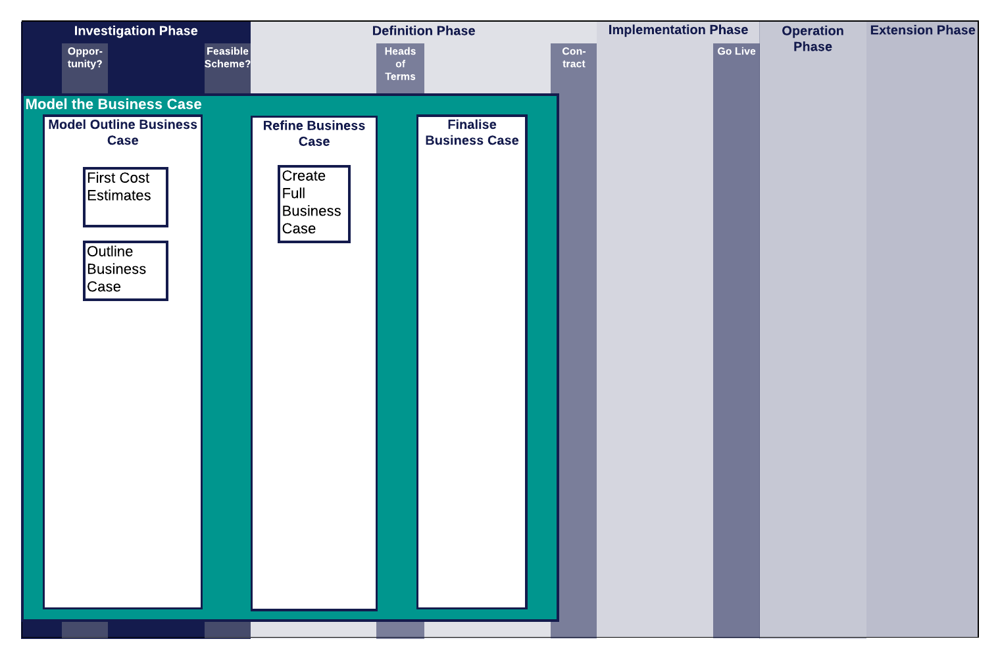

.. .. cssclass:: imprcm-wip

.. heading sequence */* = - ^ "

.. _model-the-business-case-for-a-potential-xircm-scheme:

*******************************************************
Model the Business Case
*******************************************************
This page contains all the guidance, or links to guidance, that may be needed by someone modelling a potential Cross-industry RCM business case.

Context
========

See :ref:`introduction-to-xircm` for a lay-person's guide to Cross-industry RCM.

.. figure:: https://www.lucidchart.com/publicSegments/view/5485ac24-b2f1-4591-8c44-b3306f9e6849/image.png
  :alt: Summary Cross-industry RCM overview
  :name: model_process_map_overview

  Cross-industry RCM Project Process Map - Overview

The figure :ref:`model_process_map_overview` shows the Model the Business Case workstream in the context of the project phases and gateways and the other workstreams.  More detail on these aspects of a Cross-industry RCM project can be found in :ref:`scheme-process` and the pages devoted to the other workstreams.

Tasks
==================================

  Model the Business Case Workstream

Model the Outline Business Case
--------------------------------
This task is carried out near the start of the project during the Investigation phase, to see if there is the possibility of a business case for the project. It may involve the use of :ref:`business-case-tool`.

Refine Business Case
--------------------
This task is carried out in the early part of the Definition phase. :ref:`business-case-tool` is intended for use at the level of detail required at this time. It enables the overall case for the project to be examined, optioneering to be done and the outline of the relative costs and benefits to the involved parties to be identified.

Finalise Business Case
----------------------
This task involves compiling a Business Case which fulfils all the requirements of the Sponsor's organisations project control process. It may require the use of other planning tools, but the data compiled for input to the Business Case Tool and its interim results will be useful inputs.

.. seealso::

	.. toctree::
	  :titlesonly:

	  businesscasetool

