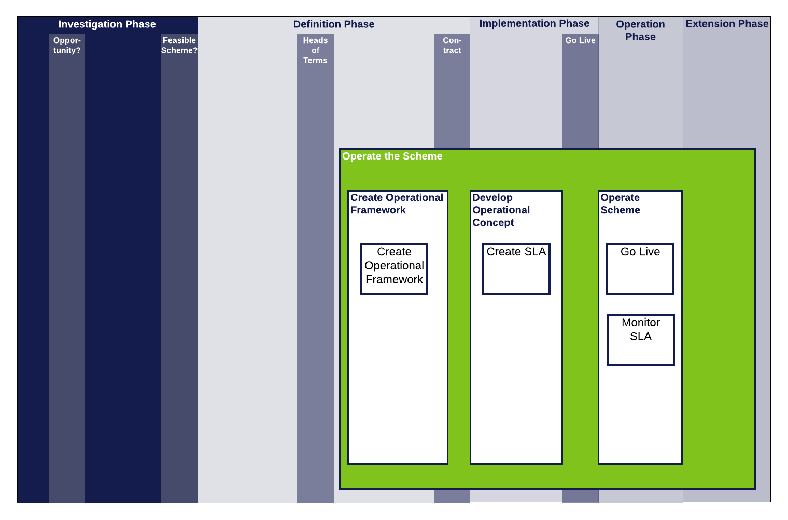

.. heading sequence */* = - ^ "

.. .. cssclass:: imprcm-wip

.. _operate-an-xircm-scheme:

*************************************
Operate the Cross-industry RCM scheme
*************************************
This page contains all the guidance, or links to guidance, that may be needed by someone planning the live operation of an XI RCM scheme.

Context
========

See :ref:`introduction-to-xircm` for a lay-person's guide to Cross-industry RCM.

.. figure:: https://www.lucidchart.com/publicSegments/view/5485ac24-b2f1-4591-8c44-b3306f9e6849/image.png
  :alt: Summary Cross-industry RCM overview
  :name: operate_process_map_overview

  Cross-industry RCM Project Process Map - Overview

The figure :ref:`operate_process_map_overview` shows the Operate the Scheme workstream in the context of the project phases and gateways and the other workstreams.  More detail on these aspects of a Cross-industry RCM project can be found in :ref:`scheme-process` and the pages devoted to the other workstreams.

Operate the Scheme: Tasks
===========================

  Operate the Scheme Workstream

Create Operational Framework
-----------------------------

The Operational Framework is the part of the contractual agreement that deals with the live operation of the scheme: the mechanics of collecting, processing and storing the RCM data and making it available.

.. todo:: More cross-referencign to the contractual sections that deal with Operations: chiefly the Specificaiton and SLA

Develop Operational Concept
----------------------------

The Operational Concept is the set of processes, practices and documentation needed to operate the Scheme.

.. todo:: more detail on what would be involved in the Operational Concept.

Operate Scheme
----------------

This is the tasks that would need to done to manage the scheme in live operation.

.. todo::  Link to any guidance available from T1010 on scheme operation. (There isn't a great deal).

Guidance
=========

.. todo::

   work on implementation to be agreed. In scope?
   - List of implementation activities (contract schedules may help).
   - Suggest where guidance is needed / where it should be prioritised (steering group)
   - Write guidance

.. toctree::
  :titlesonly:
  
  implement_how
  operational_framework
