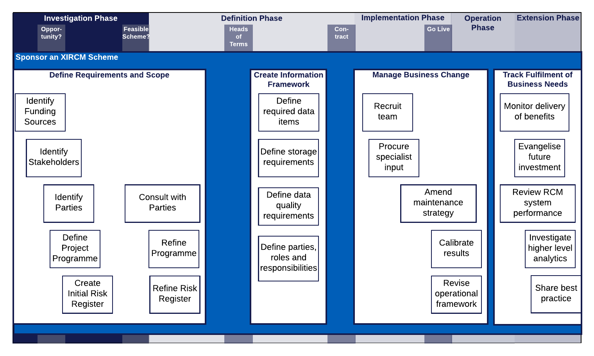
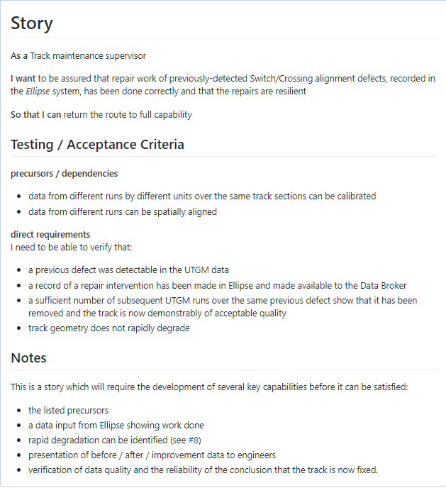
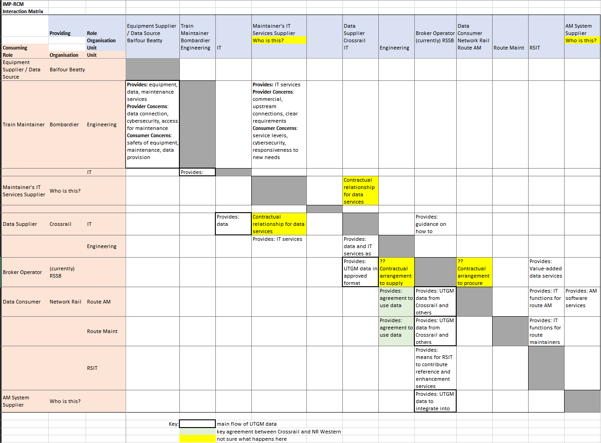

.. heading sequence */* = - ^ "

.. .. cssclass:: imprcm-wip

.. _act-as-sponsor-for-an-xircm-scheme:

************************************
Sponsor a Cross-industry RCM scheme
************************************

A Cross-industry RCM project needs a business sponsor to take responsibility for

- defining the goals of the scheme
- identifying the stakeholders and funders
- overseeing the management of its definition, implementation and delivery
- managing the business change needed to make it effective
- ensuring it delivers the promised business benefit
- seeking opportunities to enhance the benefit in future work on the project and others that could learn from it.

The :term:`T1010` toolkit offers some advice and guidance to project sponsors which is summarised in this page. Links are provided to the source T1010 documents as appropriate.

The sponsor will need to work within their organisation's project control process (such as Network Rail's :term:`GRIP` process). This page is not a guide to these processes but will indicate where Cross-industry RCM considerations might feed into them.

Context
========

See :ref:`introduction-to-xircm` for a lay-person's guide to Cross-industry RCM.

.. figure:: _static/images/process/process_map_overview.png
  :alt: Summary Cross-industry RCM overview
  :name: sponsor_process_map_overview

  Cross-industry RCM Project Process Map - Overview

The figure :numref:`sponsor_process_map_overview` shows the Sponsor workstream in the context of the project phases and gateways and the other workstreams.  More detail on these aspects of a Cross-industry RCM project can be found in :ref:`scheme-process` and the pages devoted to the other workstreams.

The Sponsor's Tasks
===================

  Sponsor Workstream

.. _sponsor-scope:  

Define Requirements and Scope
-----------------------------

The requirements for the scheme need to be identified early on in the :ref:`phase-investigation`, refined during the :ref:`phase-definition` and validated as part of the testing in the :ref:`phase-implementation`.

This is essentially a business process re-engineering task in which a beneficial business change is identified and the changes to processes, data flows, stakeholder interactions and job-specifications are worked out. 

The task will need to encompass the detailed sub-tasks shown in :numref:`sponsor_workstream` since these generate important scheme artefacts.

The artefacts that this task creates are:

- A set of **User Requirements** and the outline of an **Acceptance Test Strategy**.
- A **Funding Statement** indicating, in outline at least, where the funding for the project will come from at each of its stages.
- A **Stakeholder Matrix** indicating the roles, responsibilities and interests of the stakeholders, plus an engagement plan for how to interact with them through the project.
- A **Project Programme** specifying the timings of project activities and the interactions and dependencies between them.
- A **Risk Register** identifying the risks to the project's outcome, budget and timetable and external risks, plus mitigation measures.

.. tip::
   
   In the IMPRCM pilot, these analysis techniques proved useful in defining the scheme requirements and scope:

   - **User Story analysis**. We created a set of candidate user stories based on discussions with project stakeholders, particularly those associated with the potential uses for the data gathered: track maintenance engineers and asset management specialists.  The user stories relate directly to desired business benefits and therefore act as a good starting point for more detailed analysis and the creation of user acceptance tests. From the set, we focussed on one that could generate benefit in the short run without fundamental business process change.  See further guidance and example here: :ref:`guidance-user-stories`.
   - **Stakeholder Interaction Matrix**. This is a matrix showing the sources and targets of the information flows that would be needed to satisfy the selected user story. It was a helpful aid to discussion with project stakeholders to help define the data flow and the relationships implied. This enabled all the stakeholders to be identified, plus the essential characteristics of the interfaces between them. Each of these interfaces could potentially require a contractual relationship to be established. See further guidance and an example matrix here: :ref:`guidance-business-interaction-matrix`.
 

.. tip::

   **Scheme requirements** were collected from several sources: railway standards, the :term:`T1010` data architecture, other data sharing initiatives including :term:`In2Rail`, and specific demands of the selected user story. See further guidance here: :ref:`guidance-requirements`.  The Sparx Enterprise Architect tool (`Enterprise Architect <https://sparxsystems.com/>`_) was used to capture and organise the requirements.

Create Information Framework
-----------------------------

The Information Framework is a document which defines the content and other characteristics of the data flow needed to satisfy the scheme requirements.  It covers:

- the **data content** - the data items required. These will include the condition measures, but will also contain vital context such as details of the assets being monitored, the time and date of data collection, calibration and status information for the capturing and processing equipment, and useful background and context such as the identities of trains or locations.
- **data quality requirements** - timeliness, accuracy, precision, consistency, completeness, readability, standards compliance, metadata required. The quality requirements should be set at levels that satisfy the business need, but do not "gold-plate"  or add complexity or cost unnecessarily (see :term:`Gold Plating`).
- **data storage requirements** - how long should data be stored for, at what level of completeness or detail, how the data should be accessed, how quickly it should be accessible, what are the consequences of data loss, backup / restore arrangements, redundancy and disaster recovery.
- **data pipeline** - what is the data pipeline from source through to consumption at the final target?  What storage, transmission, manipulation and processing is done en route and by whom?.

For more guidance and best practice on preparing the Information Framework document, see :ref:`information-framework`.

.. _sponsor-manage-business-change:

Manage Business Change
------------------------

The success of the scheme will depend on how effectively the data flow it offers is embedded into the working practices of the data users. The business change necessary can have several important aspects that the Sponsor needs to manage:

- alignment with, or changes to, existing Railway Group Standards or Company Standards, to allow the use of the new data flow and analysis from it in safety-related areas such as asset maintenance.
- changes to other linked or associated IT systems
- changes to documented processes
- changes to staff job descriptions
- staff re-skilling and acquisition
- special skills required to assist in transition
- parallel operation, fallback, backup processes
- fine-tuning and calibration of the scheme outputs
- review of the system operational framework after bedding-in and some live running
- phase-out of replaced data streams and systems
- management of reputation and publicity.

.. note::

   These aspects have not been covered to any depth in the IMPRCM work.

.. _sponsor-track-fulfilment:

Track Fulfilment of Business Needs
-----------------------------------

The success of the scheme depends on how well it delivers the benefits forecast for it during the investigation and definition phases, and to what extent it is seen as a strong platform for future enhancement.  The Sponsor needs to:

- check the extent to which the scheme is delivering the benefits
- monitor and review the performance of the RCM scheme against its SLA and expectations
- look for opportunities to get more benefit by moving up the :term:`ISO 13374` maturity levels: bringing in new contextual data sources and doing more sophisticated analysis of the current data sources.
- work to share good practice and lessons learned, and to absorb them from other projects to improve the effectiveness of Cross-industry RCM both for the current scheme and more broadly.

Interactions with other workstreams
===================================

As the prime mover of the Cross-industry RCM scheme, the Sponsor's work drives that of the other scheme workstreams. In particular, the documents created by this workstream are inputs to the more detailed workstreams looking at the business case, the commercial and legal agreements and the technical aspects of the scheme.

Business Case workstream
------------------------

The business case workstream is described in :ref:`model-the-business-case-for-a-potential-xircm-scheme`.

The Sponsor workstream establishes the business goals of the project which will be expressed as benefits that get realised by the reduction in costs of management, maintenance and repair of assets on the other side of the wheel/rail interface. The business case effort seeks to quantify these benefits.  

This workstream also aims to identify how the scheme changes the :term:`ISO 13374` maturity level and therefore what level of investment in technnology and business process change will be necessary. This has an impact on the scheme costs and timing.

Negotiate Agreements workstream
--------------------------------

The commercial negotiation workstream is described in :ref:`strike-a-commercial-agreement-for-an-xircm-scheme`.

The Sponsor workstream identifies several important aspects of the scheme that affect the commercial workstream:

- The **stakeholders** and the interfaces between them, which may require commercial agreements
- The **requirements** which define the purpose of the scheme and the regulatory context
- The **Information Framework** which feeds into the Data and Service Level Agreement schedules
- The **project programme** which feeds into the contract text and Programme schedule
- The **risk register** which feeds into the Risks schedule and contract conditions.

Address Technical Aspects workstream
---------------------------------------

The technical workstream is described in :ref:`set-up-technical-aspects-of-an-xircm-scheme`.

The Sponsor workstream directly drives the work of the technical workstream:

- Any **interface between stakeholders** requires a technical component to deliver it
- The **data items** in the Information Framework form the data content of interfaces
- The **data storage requirements** drive the hardware requirement
- The **data quality** considerations influence the architecture and scale of technical approaches
- The implied :term:`ISO 13374` maturity levels drive the standards and data interchange mechanisms to be considered.

Operate the Scheme workstream
------------------------------

The operation workstream is described in :ref:`operate-an-xircm-scheme`.

The Operational Framework describes how the scheme will run day-to-day. This is driven by the data quality requirements defined in the Information Framework.  Also important are the various aspects of storage accessibility, data safety and access management which flow from the other aspects of the Information Framework.

Guidance - IMPRCM experience
=============================

.. _guidance-user-stories:

User stories
------------
The IMPRCM team used `Github issues <https://github.com/>`_ as a simple way to create, share, link and track user stories.  :numref:`sample_user_story` shows a sample user story in github.

  Sample User Story

Background on the use of User Stories as a requirements-gathering technique can be found in various places. This is a good starting point: `User Stories <https://www.mountaingoatsoftware.com/agile/user-stories>`_.

.. _guidance-business-interaction-matrix:

Stakeholder Interaction Matrix
-------------------------------

The IMPRCM team built a Stakeholder Interaction Matrix using Excel.  :numref:`sample_sim` shows a screenshot.

  Sample Stakeholder Interaction Matrix

.. tip::

   Use the cells of the matrix to highlight key aspects of each interface for further consideration - these may be sensitivities of stakeholders to liability, use of their data or similar; or particular constraints on the interface or the relationship that will need to be reflected in any agreement.

 
The actual matrix used by the IMPRCM project is available for download here: :download:`Stakeholder Interaction Matrix IMPRCM Example <_static/downloads/sponsor/IMP-RCM_Stakeholder_Interaction_Matrix.xlsx>`.

.. _guidance-requirements:

Requirements and Acceptance Tests
-----------------------------------

For the IMPRCM prototype data broker, the requirements for the data interchange and the prototype broker were assembled into a spreadsheet, and subsequently into a Sparx Enterprise Architect repository [#]_, from the following sources:

- the requirements of the T1010-01 data architecture deemed to be relevant to the IMPRCM broker, given that it was a proof of concept and not a fully-specified production-quality solution. [#]_
- requirements of the :term:`In2Rail` programme data and application architecture. [#]_
- requirements driven by the chosen User Story: verification that S&C repairs have been correctly carried out.

The requirements were analysed and a set of "features" created: deliverable elements of the prototype solution. For each of these, a number of acceptance tests was devised. These were specified using the :term:`Gherkin` language.

.. rubric:: Footnotes

.. [#] A downloadable version of the requirements repository in Enterprise Architect format is here: :download:`Requirements Repository<_static/downloads/requirements/IMPRCM Broker Requirements.eapx>`.

.. [#] T1010-01 requirements are in the "Architecture Principles and Requirements" document linked to here: :ref:`t1010-01_docs`. Of these, roughly 70% were seen to be relevant to the protoype broker.

.. [#] :term:`In2Rail` requirements were supplied by Network Rail's representative on the programme. General details on the programme are here: |in2rail|_.  The requirements for the Application Framework and the Canonical Data Model are listed here: |in2rail-req|_.