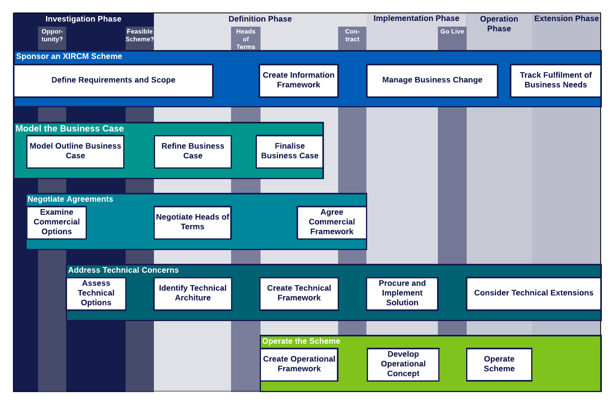

.. .. cssclass:: imprcm-wip

.. heading sequence */* = - ^ "

.. _set-up-technical-aspects-of-an-xircm-scheme:

**************************************************************
Address Technical Concerns 
**************************************************************
This page contains all the guidance, or links to guidance, that may be needed by someone managing the technical aspects of a Cross-industry RCM scheme.

.. Introduction - what this section is for, who should use it, roadmap for integration, different methods of data transfer.

Context
========

See :ref:`introduction-to-xircm` for a lay-person's guide to Cross-industry RCM.

This workstream tackles the **technical** aspects of the scheme's data flow. These aim to deliver the business requirements for the data flow, already defined in the :ref:`information-framework` created in the :ref:`act-as-sponsor-for-an-xircm-scheme` workstream.  See :ref:`tech-scope` for details of the scope of this workstream.

  Cross-industry RCM Project Process Map - Overview

:numref:`technical_process_map_overview` shows the Address Technical Concerns workstream in the context of the project phases and gateways and the other workstreams.  More detail on these aspects of a Cross-industry RCM project can be found in :ref:`scheme-process` and the pages devoted to the other workstreams.

This workstream covers the roles of IT practioners and project managers responsible for the technical specification, design and procurement of a Cross Industry RCM scheme. See :ref:`tech-roles` for more details of the technical roles involved.

The :term:`T1010` documentation, specifically the :ref:`T1010-01 Data Architecture <t1010-01_docs>`,  provides extensive guidance on the technical aspects of the data interchange:

- Choosing the most appropriate solution architecture for the scheme, depending on its current scope and expected future development
- Standards to apply in the actual data processing blocks and interfaces between them, to maximise the efficiency of the solution and to support future novel uses of the data
- Sizing and scoping calculations
- Managing the solution over time as needs and challenges change.

The guidance is collected together in the :ref:`tech-guidance-tf` section. This guidance also includes tips gathered from work on the prototype broker-based interface built as part of :ref:`intro-IMPRCM`.  Links to this guidance appear at relevant points below.

.. _tech-roles:

Stakeholder Technical Roles
===========================

A Cross Industry RCM Scheme involves several participating parties; and for each party, several technical roles. The main roles are listed in :numref:`tab_technical_roles`.

.. table:: Technical Roles
   :class: table-hover
   :name: tab_technical_roles
   :widths: 1 100 200

   +-------------+-------------------------------------+-----------------------------------------------------------------+
   |             |Role                                 |Description                                                      |
   +=============+=====================================+=================================================================+
   |.. _role_sa: |Solution Architect                   |Responsible for choosing and defining the solution architecture  |
   +-------------+-------------------------------------+-----------------------------------------------------------------+
   |.. _role_sdu:|Scheme Data User                     |Technical representative of the end user of the scheme data      |
   +-------------+-------------------------------------+-----------------------------------------------------------------+
   |.. _role_rdp:|RCM Data Provider                    |Technical representative of the provider of the RCM data         |
   +-------------+-------------------------------------+-----------------------------------------------------------------+
   |.. _roie_pip:|Data Processing Pipeline Builder     |Developer of the data processing pipeline                        |
   +-------------+-------------------------------------+-----------------------------------------------------------------+
   |.. _roie_ref:|Reference Data Provider              |Technical representative of a provider of lookup data            |
   +-------------+-------------------------------------+-----------------------------------------------------------------+
   |.. _role_usd:|Data Use Solution Developer          |Developer of system that uses the scheme's data                  |
   +-------------+-------------------------------------+-----------------------------------------------------------------+
   |.. _role_asp:|Data Augmentation Service Provider   |Provider of a service which adds value to the RCM data stream    |
   +-------------+-------------------------------------+-----------------------------------------------------------------+
   |.. _role_brm:|Broker Manager                       |Manager of a data broker which mediates the data interchange     |
   +-------------+-------------------------------------+-----------------------------------------------------------------+
   |.. _role_mor:|Maintainer of Standards              |Party responsible for managing data interchange standards        |
   +-------------+-------------------------------------+-----------------------------------------------------------------+
   |.. _role_op: |System Operator                      |Operator of the data interchange system                          |
   +-------------+-------------------------------------+-----------------------------------------------------------------+

The :term:`T1010` data architecture defined in T1010-01 impacts upon all of these roles. The guidance below is structured to help people carrying them out.

.. _tech-scope:

Workstream Scope
===================

The workstream has to consider these technical concerns:

- the **data to be interchanged** in order to meet the business needs of the data consumers and its required characteristics: data quality, timeliness, reliability etc. The work here feeds into the :ref:`Commercial Framework <commercial-guidance>`, specifically in Schedule 2 (Data) and Schedule 6 (Service Level Agreement).
- the **way the data are interchanged**. This covers the architecture of the solution and the specification of data collection equipment, telecommunications and any hardware and software elements used to transfer, process, store and present the data. These are documented in the :ref:`technical-framework`. This feeds into the Commercial Framework Schedule 2 (Equipment) and the :ref:`operational-framework`.
- the **procurement, construction and implementation** of the technical solution through to live operation
- consideration of **opportunities to extend and enhance** the solution once in operation.

These are detailed below. 

.. _tech-concerns-data:

Data-related Concerns
---------------------

Data-related technical concerns build upon the business-related data requirements defined in the :ref:`information-framework`. They involve the specification and delivery of these data-related elements:

- collection equipment - trackside or mounted on vehicles
- remote data processing and storage
- transmission and interfacing
- processing pipeline, which may have many stages and participants
- storage and retrieval
- querying
- visualisation
- integration with data user's existing IT systems
- archiving, backup and restore
- security and access control.

.. _tech-concerns-architectural:

Solution Architecture 
------------------------------

The technical solution can be developed using different architectural approaches, the choice of which depends on the specifics of the data interchange, the technical context, the likely future development of the solution and broader industry-level concerns beyond the immediate project.

.. figure:: https://www.lucidchart.com/publicSegments/view/b27e7ec8-f94c-4ac4-bee5-a175e4297920/image.png
  :alt: Block diagram - typical system
  :name: tw_physical_typical

  Cross Industry RCM - Block diagram of a typical system

:numref:`tw_physical_typical` shows a sample architectural block diagram for a typical scheme.  It contains the data-related elements listed in :ref:`tech-concerns-data`. 

This is just one possible scheme arrangement: a given scheme may be much simpler, in which case not all the functions are necessary; or it may involve more parties and shared data, in which case it may involve a broker or other way to mediate the data exchange. :ref:`tech-guidance-tf` gives some guidance on these architectural concerns.

.. _tech-concerns-physical:

Physical / Implementation 
-----------------------------------

For any chosen architecture, there are different approaches possible to implementing it. These include matters such as:

- location of system components: are they remote, shared / cloud-based or on-premises?
- building vs buying the solution elements
- integration with existing / upcoming industry services
- choice of hardware, operating systems, databases and programming languages
- use of bespoke or off-the-shelf hardware components
- networking and telecommunications.

.. _tech-concerns-other:

Cross-cutting Concerns
-----------------------

The workstream will also need to take account of some cross-cutting concerns:

- operational principles and service levels
- constraints set by the IT environment and stakeholders' IT setup
- governance and regulatory conformance
- technical change management.

Workstream Tasks
===================

  Technical Workstream

:numref:`technical_workstream` shows the key tasks of this workstream. The upstream elements, carried out in the :ref:`phase-investigation` and :ref:`phase-definition`, are architectural and specification-level in nature.  During the subsequent :ref:`phase-implementation`, they are design- and construction-related.

In the sections below, these tasks are considered from the perspective of the :ref:`tech-roles` listed above. Links are provided to relevant items of guidance in the :ref:`tech-guidance-tf`. 

Assess Technical Options
-----------------------------

The :ref:`act-as-sponsor-for-an-xircm-scheme` workstream identifies the data items and characteristics needed to fulfil the business need: these are documented in the :ref:`information-framework`.  This task considers the technical options for delivering the business requirements. 

Is a Cross-Industry Scheme actually required?
^^^^^^^^^^^^^^^^^^^^^^^^^^^^^^^^^^^^^^^^^^^^^^

An early consideration should be whether there is actually need for a Cross-industry RCM scheme - whether existing data sources or sensors are already available. A cross-industry scheme adds layers of complexity that can be avoided if the monitoring can be done by the asset owner. (see :ref:`what-is-xircm` for an introductory definition) [#]_

.. _tech-data-requirements:

Outline the Data Requirements
^^^^^^^^^^^^^^^^^^^^^^^^^^^^^^

.. note:: Task carried out by Solution Architect

In this task, the technical implications of the business data needs (already defined in the :ref:`information-framework`) are considered. These will typically include:

- the relevant :term:`ISO 13374` processing levels
- technical data formats and schemas
- database designs
- sizing calculations for data in motion and at rest
- interfacing methods between solution components
- interfaces to external data sources such as reference data lookups
- interfaces with external data augmentation and data storage services
- possible future uses of the data. 

The output of the task is the first cut of the :ref:`technical-framework`, specifically sections :ref:`tf-data` and :ref:`tf-interfaces`.  

:term:`T1010` has requirements and recommendations in this area: see the :ref:`tech-guidance-tf`.

.. _tech-technical-approach:

Outline the Technical Approach
^^^^^^^^^^^^^^^^^^^^^^^^^^^^^^^^

In this task, options for the technical architecture of the solution are compiled, based on:

- the data requirements established in the ":ref:`tech-data-requirements`" task
- other business requirements from the :ref:`information-framework`, particularly;
  
  - the :ref:`info-fw-data-characteristics`
  - the expected scale of the scheme, both initially and into the future (:ref:`info-fw-data-volumes`)
  - the components of the :ref:`info-fw-pipeline` and whether they are already available or need to be built anew

- the technical context: 

  - what functions, services and facilities are already available
  - what constraints apply: hosting platforms, languages, database systems, telecomms methods and bandwidth, available skills, regulations and industry standards, the law

- conformance to best practice, such as that outlined in the :ref:`technical-guidance`.
- other overriding considerations such as cyber-security, future-proofing, vendor-independence, stakeholder strategy.

The task considers and suggests options for:

- the overall scheme architecture - direct interface, client-server, broker-based (:reF:`tf-architecture`)
- "build vs buy" decisions: new vs existing / shared elements and services; in-house development vs commercial procurement
- types of external and internal interfaces
- physical deployment / hosting of system: local or cloud-based; concentrated or distributed
- data storage and retrieval methods.

Each of the options will involve a matrix of participating parties, technical roles within those parties, interfaces between the parties, and data transfer between them. These should be identified and documented in a **Technical Options Document**.

:term:`T1010` has recommendations and guidance for the types of interaction that may be involved and the ways of specifying the data interchanges. 

.. _tech-technical-architecture:

Identify the Technical Architecture
-------------------------------------

In this task, the technical architecture of the solution is determined. The options are whittled down to a single agreed approach.

The deliverable from this task will be an expanded :ref:`technical-framework` with  the first draft of the sections of the :ref:`technical-framework` on :ref:`tf-architecture`, :ref:`tf-data-processing` and :ref:`tf-interfaces`.

Create Prototype
^^^^^^^^^^^^^^^^^

This task may involve the use of prototyping to flush out issues and assess the viability of options before committing to a single approach. Prototypes typically use a small set of assets and low data volumes and ignore the cross-cutting concerns of security, access control and lifecycle management. They can be very effective in reducing project risk.

Create the Technical Framework
-------------------------------

In this task, the formal technical documentation is compiled to support the commercial agreement and the procurement of the required solution. This involves the finalisation of the :ref:`technical-framework`.

The task provides input to other project documentation necessary to support the scheme:

- to the :ref:`Business Case <model-the-business-case-for-a-potential-xircm-scheme>`: cost estimates, risks, timetables, stakeholder map.
- to the :ref:`Commercial Framework <commercial-guidance>`: :term:`IP` concerns, timetable, outline of the Service Level Agreement.

Procure and Implement the Solution
-----------------------------------

In this task, the technical solution is procured, installed, tested and brought into use.  

Procure the Technical Solution
^^^^^^^^^^^^^^^^^^^^^^^^^^^^^^^

The technical role here is one of Systems Integrator, responsible for commissioning or creating all the technical elements of the solution.

Where solution elements are being **procured**, the specification of the element should be based on the :ref:`technical-framework`, taking due account of the industry standards and :term:`T1010` recommendations.

Where solution elements are being **created**, standard IT project methodologies should be employed. Since the essence of the scheme is of data integration, known to be risky in software terms, best current practice should be adopted, including techniques such as:

- iterative development
- agile, reactive methods
- early and continuous integration / deployment.

The output of this task is a factory-tested solution ready for deployment and user test.

Install and Test the Solution
^^^^^^^^^^^^^^^^^^^^^^^^^^^^^^

This task involves all the elements needed to bring the scheme into production use. These will include:

Installation
""""""""""""""

- installation and site-testing of first-fit data collection hardware
- commissioning of telecommunications links
- configuration of user access and security
- setup of data storage
- setup of databases
- integration of live reference data sources
- setup of backup and disaster recovery processes
- population of databases with reference information
- commissioning and configuration of the data processing pipeline
- configuration of data archiving / housekeeping processes
- integration with downstream users and IT systems.

Testing
""""""""""
These elements result in a sign-off of the system hardware/software being ready for operation.

- installation testing of the system components
- throughput / availability / robustness testing of telecommunications
- integration testing of the whole solution
- testing of backup / restore functions
- security testing
- user acceptance testing.

Transition
""""""""""""
These elements result in a sign-off that the scheme is ready for live operation. The technical workstream needs to support these activities which are described in :ref:`sponsor-manage-business-change`, part of the :ref:`act-as-sponsor-for-an-xircm-scheme` workstream.

- design and implementation of business change procss
- user training and familiarisation
- preparation of operational concept (which feeds into the workstream :ref:`operate-an-xircm-scheme`)

Consider Technical Extensions
------------------------------

Following implementation, this task involves providing technical input into work to extend the project. The extensions may be of:

- **scope**, such as:

  - enhancement to a higher level of the :term:`ISO 13374` stack
  - the integration of other data sources
  - provision of better analytics
  - deeper integration into business processes and existing systems. 
 

- **scale**, such as: 

  - deployment to a larger geographical area
  - extension to new type of asset
  - preservation of data to a higher level of detail or for longer

- **adoption**, such as:3

  - opening up closed functions for broader use
  - moving to a broker-based architecture to support expansion and data sharing
  - change from proprietary to open data formats
  - sharing of documentation and development tools.

The project sponsor is responsible for identifying and managing project enhancement. See :ref:`sponsor-track-fulfilment`.

Linked pages
===============

.. toctree::

   technical_framework
   technical_guidance

.. [#] Source: |t03_3_1|_

.. footnotes
.. |t03_2| replace:: T1010-03 Section 2 Project Lifecycle
.. _t03_2: _static/T1010/T1010-03/A_good_practice_guide_for_the_introduction_of_cross_industry_RCM.pdf#page=3

.. |t03_3_1| replace:: T1010-03 Section 3.1 Consider need for Cross-Industry RCM
.. _t03_3_1: _static/T1010/T1010-03/A_good_practice_guide_for_the_introduction_of_cross_industry_RCM.pdf#page=4

