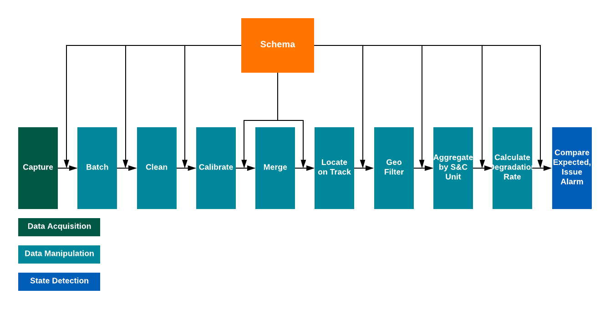

.. heading sequence */* = - ^ "

.. .. cssclass:: imprcm-wip

.. _technical-guidance:

*******************************
Technical Workstream - Guidance
*******************************

This page contains guidance in preparing the key information-related documents for a Cross-Industry RCM scheme:

- guidance on the :ref:`information-framework` - see :ref:`tech-guidance-if`
- guidance on the :ref:`technical-framework` - see :ref:`tech-guidance-tf`
- guidance on the :ref:`operational-framework` - see :ref:`tech-guidance-of`. 

The guidance comes from two main sources:

- The :term:`T1010` Data Architecture documentation (sources: :ref:`t1010-01_docs`)
- Experience gained in :ref:`intro-IMPRCM`, shown as tips.

.. _tech-guidance-if:

Information Framework - Guidance
======================================================

These guidance notes highlight specific points taken from the :term:`T1010` documentation relevant to the :ref:`information-framework`.  Where the IMPRCM project shed additional light, this is mentioned as a tip.

.. _if-guide-data-items:

Data items
----------

.. _if-naming:

Naming conventions
^^^^^^^^^^^^^^^^^^

Data item names should follow a consistent standard. They should be constructed in a way that makes them as easy as possible to re-use in different circumstances. This means:

- use a consistent case throughout - not mixed case.  Lower case is generally more readable
- don't have spaces in data item names. Hyphens can cause trouble as well as they can be interpreted as minus signs in some contexts
- include the engineering units, where relevant, as part of the name so it is clear to users what they are

.. tip::

   "snake_case" with word elements separated by underscores worked best in the IMPRCM prototype.

   .. figure:: _static/images/info_fw/imprcm_tips_00004.png
     :alt: example column names
     :name: tip-col-names

     Example from IMPRCM: column naming

   :numref:`tip-col-names` shows an example from the master schema for the IMPRCM prototype broker.  

.. _if-data-types:

Data item types
^^^^^^^^^^^^^^^^

Where the type of data is known, it should be specified as precisely as possible.  Some pointers:

- numeric data types should be defined as integer, float, decimal, hexadecimal or boolean as appropriate.
- where possible the size of the data item should be specified as well: integer or bigint; float or double-precision
- dates, times and timestamps should be identified as such, not described as character strings
- character strings should be given a maximum length

.. _if-formats:

Data item formats
^^^^^^^^^^^^^^^^^^

Standard representations exist for some data items which will greatly improve re-usability of the data if adopted. Data specifications should indicate these formats for clarity.

Dates and Times
""""""""""""""""

Dates and times should be specified to be always formatted per :term:`ISO 8601`.  This means

- dates look like ``20181226`` or ``2018-12-26``
- times look like ``22:34``, ``22:34:16`` or ``22:34.16.232451`` (depending on precision)
- timezone must always be shown, either explictly with ``+00:00``  or ``Z`` for :term:`GMT` / :term:`UTC` or ``+01:00`` for :term:`BST`.
- for preference, times should be shown in UTC using the ``Z`` specifier.
- timestamps look like ``2018-12-26T22:34:16Z`` or similar, with a ``T`` separating the date and time components.

Geographical locations
""""""""""""""""""""""

Latitudes and longitudes, such as GPS locations, should be specified to be formatted in a standard way. :term:`ISO 6709` is mandated by T1010-01 as the standard representation for locations, but this is a permissive standard so the following restricted compliant approach is suggested:

- latitude should be shown in decimal degrees, like ``51.4183``, with up to 7 decimal places of precision.  (7 decimal places gives approximately 1cm resolution)
- positive latitudes are north; negative are south
- longitude should be shown in decimal degrees, like ``-0.1365``, again with up to 7 decimal places of precision
- positive longitudes are east of Greenwich; negative are west.

Track Locations
""""""""""""""""""""""""""

Network Rail track locations are generally specified in Miles + Chains or Miles + Yards along an :term:`ELR`, the miles being measured from mileposts. There is currently no Network Rail standard for representing these in data, so T1010-01 proposed one as follows:

- a distance in miles and chains should be shown as mmm:cc, miles not padded, chains padded to 2 places, e.g. ``23:17`` or ``1:04``.  The name of the data item should indicate that the distance is in miles and chains.
- a distance i miles and yards should be shown as mmm+yyyy with the yards padded to 4 places, e.g. ``23+0374`` or ``1+0088``. 
- track IDs should either be GEOGIS ones of the form ``2100`` or Sectional Appendix ones, of the form ``DF``. The name of the data item should indicate which type of track id it is.

.. warning::

   Work is under way to define a new method of defining track locations at Network Rail. The information in this section should be seen as provisional and likely to change. Track locations should be expressed in a Network Rail standard way, once defined.

.. _if-eng-units:

Engineering units
^^^^^^^^^^^^^^^^^

Numerical items should be shown in :term:`SI` units.  Where there is also a standard but different way (e.g. speeds being shown in mph), a separate data item may be included to show that value.  

Where a scaling factor is used, it should be clearly indicated in the data item name.

The data item name should indicate which unit is in use. So where a speed is recorded, it should always be shown in metres per second, but may also be shown in mph.

.. tip:: 
   There is no single standard way for expressing the engineering units in textual form as part of the data item name.  T1010-01 specifies the use of the :term:`MIMOSA` list and, optionally, the :term:`QUDT` ontology. Neither of these is particularly easy or clear to use.  There is another attempted standard, :term:`UCUM`, whose goal is to provide standards for naming units for interchange between computer systems, but doesn't give any clear way to represent, for example, combination units like metres per second.  For the IMPRCM data schemas, we used a simple standard like this:

   =============================  =================
   Unit                           Shown in name as
   =============================  =================
   metres                         _m
   metres per second              _m_s
   metres per second squared      _m_s2
   miles / chains                 _miles_chains
   miles / yards                  _miles_yards
   =============================  =================

.. _if-unique:

Uniqueness and mandatory/optional
^^^^^^^^^^^^^^^^^^^^^^^^^^^^^^^^^

Unique identifiers
""""""""""""""""""

Some data items identify items such as the assets, railway locations, measuring equipment sets. Often, assets have many different real-world identifiers and there is scope for confusion. To simplify the handling of identifiers, T1010-01 follows the practice of :term:`MIMOSA` in requiring every such thing to have a guaranteed unique identifier which is represented by a :term:`UUID`.  UUID-based identifiers should be included in the data specification.

Mandatory vs optional data items
""""""""""""""""""""""""""""""""

T1010-01 generally takes the view that data items are optional - any data source or any data row from a source may leave it blank or show a null value.  There are important exceptions, though, which should be indicated in data specifications:

- every data record must have a timestamp of the time of its creation or of any subsequent processing step
- the source equipment or software code of every data record must be identified by a :term:`UUID`
- every railway asset must be identified by a :term:`UUID`.

This is so that

- data from different sources can be merged together based on the identifiers of the things it describes
- a complete audit trail can be built up of the data's lifecycle.

T1010-01 also states that there should be a central service to issue UUIDs where they aren't available.

.. tip::

   In the IMPRCM project, the data schema required UUIDs for the data files, the multiple unit on which the :term:`UGMS` equipment was mounted, the timetabled train, the train run (train ID + date), data row and processing data adapter.

   As part of the project, a UUID service was created, which could issue UUIDs and store the real-world identifier each one referred to. It then allowed the UUID to be looked up using the real-world identifier in future. This was a simple prototype of the service called "SDAIR" - Structured Digital Asset Interoperability Registry - proposed by :term:`MIMOSA`.

   It is quite easy to generate UUIDs - most computer languages have a library function to do it.

.. _if-grain:

Grain
^^^^^^

The grain of a data flow is determined originally by the data gathering equipment which will have a natural operation frequency or spatial resolution.  Other grains may become important in the lifecycle:

- the data flow may be batched into a header / detail structure. The header has its own grain, which may be at the level of a file of data
- the data files may be batched up and transmitted once per train run or per day
- data processing algorithms may summarise the data into distance-grouped or time-grouped totals, averages or counts.

All the levels of grain at which the data are of interest should be noted in the information framework.

.. tip::

   In the IMPRCM project, the raw data rows were at the grain of one row per 0.2m of track covered.  Since little actual sample data was available, a test data generator was built which could simulate different ways of batching the data, all the way from emitting the rows in quasi-real time, through to batching them up into files representing the whole of a days's operation of a UGMS unit.

   The project also built code modules to aggregate the data to the level of each :term:`S&C` unit on the route section of interest, and to each train run over each such unit.  This, of course, greatly reduces the volume of data being handled by the downstream processing.

.. _if-schemas:

Schemas
----------

The data schema represents all the data items in the data flow and records all the characteristics noted in the sections above.  T1010-01 goes into some detail about how schemas should be managed, most of it technical and thus covered in the :ref:`technical-framework`.

An important aspect for the Information Framework is to note where schemas already exist for particular types of data. These should be used in preference to defining new schemas, as they help with standardisation and can reduce the cost of compliance.  T1010-01 suggests a shared industry repository of these schemas and a variety of methods of making sure that they remain usable and can evolve.

The schema set up in the Information Framework has an important role in the :ref:`technical-framework`, as it forms the core of the definition of the actual database structures and interface formats needed to store and move the data flow.

.. tip::

   In the IMPRCM project, an Excel spreadsheet was set up to hold the master data schema with all the data items involved in the data interchange.  Columns in the spreadsheet indicated where each data item was used in the data flow: this meant that the master schema could also be used to create sub-schemas for the interfaces between elements of the data processing pipeline.

   This spreadsheet can be downloaded for inspection as an example:  :download:`IMPRCM Master Schema <_static/downloads/schemas/schemas.xlsx>`.

.. _if-data-char-t1010-reqs:

Data Characteristics
-----------------------

T1010 does not mandate or recommend any particular set of data quality attributes or levels for accuracy, precision, completeness, consistency, timeliness or availability: these depend on the particular data flow and the business problem it addresses.

For **integrity**, T1010-01 specifies some standards that can be mandated to safeguard the data in transit. These include the use of checksums and encryption.  

For **security**, T1010-01 specifies a number of methods of access control and restriction of access by user type. These should be defined in the Information Framework if have particular importance to the business process.

For **openness**, T1010-01 specifies that data must be openly available and readable in standard formats at each stage in its lifecycle.  

For **conditions of use**, the T1010-02 commercial principles permit licensing conditions and restrictions (see :ref:`data-uses-sharing`). T1010-01 defines a way in which this information can be represented in a standard way and included or associated with the data stream (see :ref:`tf-metadata`).

.. _if-pipeline-t1010-reqs:

Processing Pipelines
---------------------

  Sample Data Processing Pipeline

:numref:`if_fig_pipeline` shows a typical (and relatively simple) data processing pipeline conforming to the :term:`ISO 13374` principles: a Data Acquisition step followed by a chain of Data Manipulation steps and a State Detection step.  (This is the data pipeline used in the IMPRCM prototype data broker).

The data flows between each processing step are open and can be specified in the Information Framework by means of a :term:`schema`. The processing steps need not be open - they may be procured from third parties - and so can safeguard any intellectual property associated with the processing.

It is likely that for some of the steps, standard algorithms or data services will be available: these should be used in preference to creating new bespoke ones for each flow.  And conversely, any new processing step should be specified in the Information Framework to be designed to be re-used.  This means the use of an :term:`API` at the input and output sides of the processing step.  T1010-01 gives some technical guidance on how to define these APIs (see :ref:`tf-api`).

The broker-based approach (described in :ref:`intro-tech-principles` in the Introduction and tried out in :ref:`intro-IMPRCM`) provides a good architecture for constructing these data pipelines in a generic and re-usable way. 

.. tip::

   The IMPRCM project built a prototype data broker in which some of the processing elements in the pipeline were services accessed using a :term:`REST`-based :term:`API`.  The APIs were specified using :term:`swagger`, a well-known standard method of defining APIs. 

   .. todo:: link to live Swagger documentation.

.. _if-ip-t1010-reqs:

Ownership and IP
------------------

As mentioned above, the principles of :term:`ISO 13374` require that data moving between processing steps be open and without any :term:`IP`. IP can reside in the processing steps themselves. 

.. _tech-guidance-tf:

Technical Framework - Guidance
===================================================

Introduction
-------------

.. todo::
	diagram showing hierarchy of concerns
	data items -> metadata -> datagrams -> data interchange methods -> orchestration -> ontology

.. note::
   Shape of guidance. T1010 principles. Levels of integration. Standards that apply at each level. Optional vs mandatory. Use / role of centralised / shared elements at each level.  Moving up the hierarchy over time.

   Elements of the Information Framework which apply at each level of integration.

   Elements relevant to different data roles - user / provider / broker operator etc

   Adapters - ideas and design

Hierarchy of concerns
^^^^^^^^^^^^^^^^^^^^^^

T1010-01 proposes a multi-purpose data architecture which can be used for Cross-industry RCM schemes of any scale and complexity, from simple file-based point-to-point interfaces right through to national-scale systems with multiple data sources, bulk data storage needs, complex processing pipelines and many and various uses for the data. 

It also recognises that best value for the industry is gained by standardisation. It therefore sets a hierarchical portfolio of standards and approaches in four important areas:

- **agreed data structures**: data item definitions, schemas and, where appropriate, data models
- **data interchange formats**: interface data structures, data transfer formats, metadata 
- **shared IT elements**, if required: documemntation and code samples, infrastructure, telecomms, processing and storage services
- **data interchange methods**: file transfers, APIs, messaging, brokering and process orchestration.

The intention is that the :ref:`Solution Architect <role_sa>` for a project selects an appropriate option from each of these four areas to match the project's requirements. The resulting system will then:

- make best use of work done before and existing capabilities
- be cheap to build
- be compliant with T1010 requirements and guidance immediately
- be easy to extend in scale and scope in a compliant way
- support ad-hoc data analysis.

T1010-01 suggests some typical levels of architectural complexity that schemes might adopt depending on the needs of the business process  (<ref>):

.. use the roles :tech-mand:`text for mandatory`, :tech-rec:`text for recommended`
   and :tech-opt:`text for optional`. The table-buildter spreadsheet does this using substitutions
   :m, :r and :o as the first characters of the cell text.

.. table:: T1010 Data Architecture - Application
   :class: table-hover
   :name: tab_arch_application
   :widths: 20 5

   +---------------------------------------------------+--------------------+-----------------------+--------------------+------------------------------+---------------------+
   |                                                   |Data User Interface |Data Supplier Interface|Data Storage Service|Industry Reference Data Lookup|External Data Service|
   +===================================================+====================+=======================+====================+==============================+=====================+
   |**System Characteristic**                          |                    |                       |                    |                              |                     |
   +---------------------------------------------------+--------------------+-----------------------+--------------------+------------------------------+---------------------+
   |RCM data sources: 1 type                           |some text           |                       |                    |                              |                     |
   +---------------------------------------------------+--------------------+-----------------------+--------------------+------------------------------+---------------------+
   |RCM data sources: multiple types                   |and some more       |text                   |text                |text                          |text                 |
   +---------------------------------------------------+--------------------+-----------------------+--------------------+------------------------------+---------------------+
   |                                                   |                    |                       |                    |                              |                     |
   +---------------------------------------------------+--------------------+-----------------------+--------------------+------------------------------+---------------------+
   |                                                   |                    |                       |                    |                              |                     |
   +---------------------------------------------------+--------------------+-----------------------+--------------------+------------------------------+---------------------+
   |Source data ISO 13374 level: SD                    |                    |                       |                    |                              |                     |
   +---------------------------------------------------+--------------------+-----------------------+--------------------+------------------------------+---------------------+
   |Source data ISO 13374 level: DM                    |                    |                       |                    |                              |                     |
   +---------------------------------------------------+--------------------+-----------------------+--------------------+------------------------------+---------------------+
   |Source data ISO 13374 level: DA                    |                    |                       |                    |                              |                     |
   +---------------------------------------------------+--------------------+-----------------------+--------------------+------------------------------+---------------------+
   |Reference data lookup: straightforward             |                    |                       |                    |                              |                     |
   +---------------------------------------------------+--------------------+-----------------------+--------------------+------------------------------+---------------------+
   |Reference data lookup: multiple, complex           |                    |                       |                    |                              |                     |
   +---------------------------------------------------+--------------------+-----------------------+--------------------+------------------------------+---------------------+
   |                                                   |                    |                       |                    |                              |                     |
   +---------------------------------------------------+--------------------+-----------------------+--------------------+------------------------------+---------------------+
   |Data processing pipeline:                          |                    |                       |                    |                              |                     |
   +---------------------------------------------------+--------------------+-----------------------+--------------------+------------------------------+---------------------+
   |                                                   |                    |                       |                    |                              |                     |
   +---------------------------------------------------+--------------------+-----------------------+--------------------+------------------------------+---------------------+
   |                                                   |                    |                       |                    |                              |                     |
   +---------------------------------------------------+--------------------+-----------------------+--------------------+------------------------------+---------------------+
   |                                                   |                    |                       |                    |                              |                     |
   +---------------------------------------------------+--------------------+-----------------------+--------------------+------------------------------+---------------------+
   |                                                   |                    |                       |                    |                              |                     |
   +---------------------------------------------------+--------------------+-----------------------+--------------------+------------------------------+---------------------+
   |                                                   |                    |                       |                    |                              |                     |
   +---------------------------------------------------+--------------------+-----------------------+--------------------+------------------------------+---------------------+
   |                                                   |                    |                       |                    |                              |                     |
   +---------------------------------------------------+--------------------+-----------------------+--------------------+------------------------------+---------------------+
   |                                                   |                    |                       |                    |                              |                     |
   +---------------------------------------------------+--------------------+-----------------------+--------------------+------------------------------+---------------------+
   |                                                   |                    |                       |                    |                              |                     |
   +---------------------------------------------------+--------------------+-----------------------+--------------------+------------------------------+---------------------+
   |                                                   |                    |                       |                    |                              |                     |
   +---------------------------------------------------+--------------------+-----------------------+--------------------+------------------------------+---------------------+
   |                                                   |                    |                       |                    |                              |                     |
   +---------------------------------------------------+--------------------+-----------------------+--------------------+------------------------------+---------------------+
   |                                                   |                    |                       |                    |                              |                     |
   +---------------------------------------------------+--------------------+-----------------------+--------------------+------------------------------+---------------------+
   |                                                   |                    |                       |                    |                              |                     |
   +---------------------------------------------------+--------------------+-----------------------+--------------------+------------------------------+---------------------+
   |**Applicable T1010 guidance**                      |                    |                       |                    |                              |                     |
   +---------------------------------------------------+--------------------+-----------------------+--------------------+------------------------------+---------------------+
   |Basic Data Item Definitions                        |:tech-mand:`Yes`    |                       |                    |                              |                     |
   +---------------------------------------------------+--------------------+-----------------------+--------------------+------------------------------+---------------------+
   |RCM Data Item Definitions                          |                    |                       |                    |                              |                     |
   +---------------------------------------------------+--------------------+-----------------------+--------------------+------------------------------+---------------------+
   |Schemas                                            |:tech-opt:`Yes`     |                       |                    |                              |                     |
   +---------------------------------------------------+--------------------+-----------------------+--------------------+------------------------------+---------------------+
   |Shared Data Models                                 |                    |                       |                    |                              |                     |
   +---------------------------------------------------+--------------------+-----------------------+--------------------+------------------------------+---------------------+
   |Interface Data Structures                          |                    |                       |                    |                              |                     |
   +---------------------------------------------------+--------------------+-----------------------+--------------------+------------------------------+---------------------+
   |Data Transfer Formats:                             |:tech-rec:`Yes`     |                       |                    |                              |                     |
   +---------------------------------------------------+--------------------+-----------------------+--------------------+------------------------------+---------------------+
   |Data Transfer Methods                              |:tech-rec:`Possibly`|                       |                    |                              |                     |
   +---------------------------------------------------+--------------------+-----------------------+--------------------+------------------------------+---------------------+
   |                                                   |                    |                       |                    |                              |                     |
   +---------------------------------------------------+--------------------+-----------------------+--------------------+------------------------------+---------------------+
   |Metadata                                           |                    |                       |                    |                              |                     |
   +---------------------------------------------------+--------------------+-----------------------+--------------------+------------------------------+---------------------+
   |Documentation and Code Samples                     |                    |                       |                    |                              |                     |
   +---------------------------------------------------+--------------------+-----------------------+--------------------+------------------------------+---------------------+
   |Shared infrastructure - processing                 |                    |                       |                    |                              |                     |
   +---------------------------------------------------+--------------------+-----------------------+--------------------+------------------------------+---------------------+
   |Shared infrastructure - data storage               |                    |                       |                    |                              |                     |
   +---------------------------------------------------+--------------------+-----------------------+--------------------+------------------------------+---------------------+
   |Shared infrastructure - security and access control|:tech-opt:`Yes`     |                       |                    |                              |                     |
   +---------------------------------------------------+--------------------+-----------------------+--------------------+------------------------------+---------------------+
   |Shared infrastructure - query serving              |                    |                       |                    |                              |                     |
   +---------------------------------------------------+--------------------+-----------------------+--------------------+------------------------------+---------------------+
   |Data interchange - file transfer                   |                    |                       |                    |                              |                     |
   +---------------------------------------------------+--------------------+-----------------------+--------------------+------------------------------+---------------------+
   |Data interchange - APIs                            |                    |                       |                    |                              |                     |
   +---------------------------------------------------+--------------------+-----------------------+--------------------+------------------------------+---------------------+
   |Data interchange - messaging                       |                    |                       |                    |                              |                     |
   +---------------------------------------------------+--------------------+-----------------------+--------------------+------------------------------+---------------------+
   |Data interchange - brokering                       |                    |                       |                    |                              |                     |
   +---------------------------------------------------+--------------------+-----------------------+--------------------+------------------------------+---------------------+
   |Data interchange - process orchestration           |                    |                       |                    |                              |                     |
   +---------------------------------------------------+--------------------+-----------------------+--------------------+------------------------------+---------------------+

.. ref to p

T1010-01

.. _tech-fw-data:

Data 
-----

.. _tech-fw-solution-architecture:

Solution Architecture and Technical Options
--------------------------------------------

The key i

.. figure:: https://www.lucidchart.com/publicSegments/view/a12d584f-c632-42a4-aba4-f56040e204ad/image.png
  :alt: Block diagram - direct interface
  :name: tg_physical_direct

  Cross Industry RCM - Block diagram of a simple direct interface

.. figure:: https://www.lucidchart.com/publicSegments/view/b27e7ec8-f94c-4ac4-bee5-a175e4297920/image.png
  :alt: Block diagram - typical system
  :name: tg_physical_typical

  Cross Industry RCM - Block diagram of a typical system

.. figure:: https://www.lucidchart.com/publicSegments/view/fa95843f-b3b6-47f9-9b53-78fd49c9ffcc/image.png
  :alt: Block diagram - broker-based system
  :name: tg_physical_broker

  Cross Industry RCM - Block diagram of a broker-based system

Characterising the data interchange

Having decided that a cross-industry scheme is required, the next consideration is the level and type of interaction between parties it demands. This has two main dimensions:

1. the most relevant level of the :term:`ISO 13374` stack involved in the interchange. Typically this will be one of these:

   - :ref:`intro-sd` - alerts and alarms. The data transferred is of the form of an alert or alarm that some measured value has fallen the wrong side of a threshold.  Here, the data source is doing the data analysis to work out if the alert/alarm condition has been reached. The data user will probably need to define the threshold levels to use: these depend on the business requirement and on the need to manage the number of alarms generated. The volume of data here is typically relatively small and there is a focus on urgency of response because something of note has already happened; but opportunities for future innovative use are limited because the source data stream is not available.
   - :ref:`intro-dm` - a more detailed level than SD: sensor data processed to a greater or lesser degree. Here, the data transferred is derived directly from the sensor data, having had certain amount of processing done by the source party.  More of the logic and context to determine what the data means for asset management or operational response will need to be provided by the data user. The volume of data is greater than at the SD level; and generally the focus would be on completeness and accuracy of the data stream rather than speed.  However, enough data are there to open up the possibilities of novel uses and extensions to functionality without changing the source party / user party relationship.
   - :ref:`intro-ha` - less detailed than SD. Here, the data source is doing more processing than at the SD level, including integration of data from multiple sensors or sources about the asset being monitored, to generate an overall status for the asset. This may result in a "green/amber/red" status for the asset. More expert knowledge of the asset is needed to make this sort of determination: this may need to be fed in by the asset owner / maintainer. This suggests a continuous interaction between the supplier party and user party to tune and adapt the logic used and keep systems up to date with relevant asset information.

2. the level of technical integration demanded by the business process. T1010-01 suggests a hierarchy of levels of complexity of integration
  

Evaluating options

At the early stage of project, several technical options may present themselves. These need to be evaluated to identify which one goes forward to the 

Technical Data Requirements

.. todo::

   Paul Barnes - sizing guide https://app.pageproofer.com/to/note/102011

.. _tech-guidance-of:

Operational Framework - Guidance
==================================